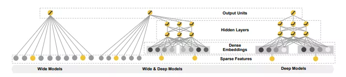
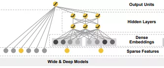
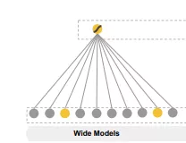
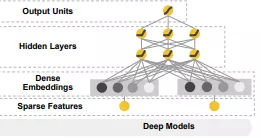
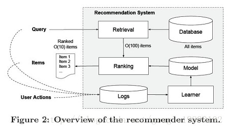
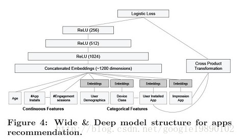
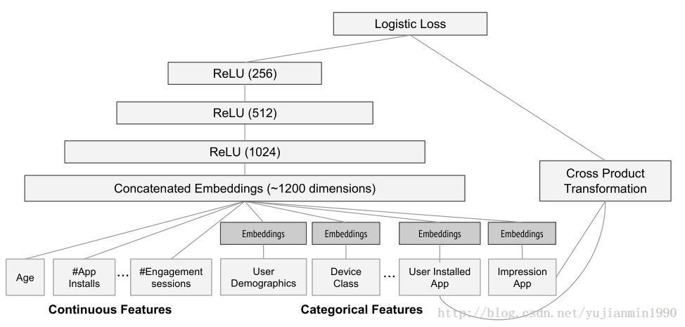
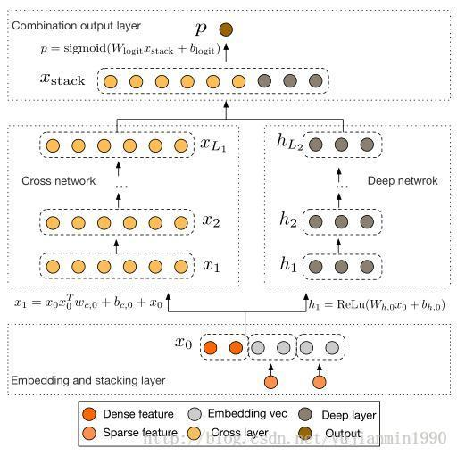

在信息大爆炸的今天，推荐系统（Recommendation System, RS）用作克服这种信息过载的通用解决方案，旨在从压倒性的在线内容和服务(例如电影、新闻和产品)中找到一组相关项目以满足用户的个人兴趣。用于推荐系统的策略有很多种，本文主要介绍的是在2016年提出的用于Google Play进行APP推荐的Wide & Deep Learning模型。

**Wide & Deep Learning for Recommender Systems**
论文地址：https://arxiv.org/pdf/1606.07792.pdf

# 1 核心思想

Wide & Deep Learning 模型的核心思想是**结合广义线性模型的记忆能力（memorization）和深度前馈神经网络模型的泛化能力（generalization）**。利用**广义线性模型**从历史数据中**学习特征相关性**，利用**深度前馈神经网络**揭示**隐式特征之间的相互作用**。在训练过程中**同时优化 2 个模型的参数**，从而达到整体模型的预测能力最优。

# 2 动机

**逻辑回归的广义线性模型，模型简单并且可解释性强，因此被广泛应用在工业环境中的大规模在线推荐和排名系统中** 。模型通常使用one-hot编码训练二值化稀疏特征。基于嵌入（Embedding）的模型，例如分解机(FM)或深度神经网络（DNN），通过为每个query和项目特征学习低维密集嵌入向量，进一步推广到以前未见过的query-item特征对。然而，**当基础query项目矩阵稀疏且高维时，例如具有特定偏好的用户或具有很少吸引力的小众项目，难以学习查询和项目的有效低维表示。在这种情况下，大多数query-item对之间应该是没有交互的，但是，密集嵌入（dense embeddings）将导致所有query-item对的非零预测，因此可能过度概括并产生不太相关的推荐。**

基于这些问题，提出了Wide & Deep learning模型，联合训练wide线性模型和深度神经网络模型，将memorization和generalization的优点结合起来。**使用 wide线性模型（Wide Model）用于记忆，使用深度神经网络模型（Deep Model）用于归纳。**

- Memorization是从历史数据中学习特征的共性或者相关性；Generalization为相关性的传递，发现历史数据中很少或者没有出现的新的特征组合，来提高推荐物品的多样性。

- ”query“为**当用户访问app store的时候生成的许多用户和文本特征。**

# 3 原理

Wide & Deep Learning模型分为Wide model与 Deep model两部分，wide部分学习一些明确的特征依赖关系，deep部分在特征嵌入向量的级联上采用MLP来揭示隐式特征之间的相互作用。

## wide 模型
wide 模型是的广义线性模型，如图下图所示。

$$
\mathrm{y}=\mathrm{W}^{\mathrm{T}} \mathrm{x}+\mathrm{b}
$$

其中：

- y是预测值；
- x = [x1，x2，...，xd]是d维特征的向量（包括两部分）；
- w = [w1，w2，...，wd]是模型权重，b是偏差。

**输入x（特征集合）包括原始输入特征和转换特征**。常选择**交叉积转换特征（cross-product transformation）（简单的说就是逻辑与运算（AND））**，其定义为：

$$
\emptyset_{\mathrm{k}}(\mathrm{x})=\prod_{\mathrm{i}=1}^{\mathrm{d}} \mathrm{x}_{\mathrm{i}}^{\mathrm{c}_{\mathrm{ki}}} c_{\mathrm{ki}} \in\{0,1\}
$$

> 交叉积：相当于“逻辑与”运算AND，AND{A,B}当且仅当"A=1且B=1“时，交叉特征才为1。如果第i个特征是第k个变换φk的一部分，则c_{ki}为1，否则为0。

## Deep 模型

deep model 是深层前馈神经网络，如下图所示：

对于类别特征，原始输入是特征字符串（例如：“language=en”）每一个稀疏的高维类别特征首先被转换为低维且密集的实值向量，通常被称为嵌入向量（embedding vector）。嵌入向量随机初始化，然后最小化模型训练期间的损失函数。然后将这些低维密集嵌入矢量馈送到前向通道中的神经网络的隐藏层中。每个隐藏层执行以下计算：

$$
a^{(1+1)}=f\left(W^{1} a^{1}+b^{1}\right)
$$

其中：
- l是层数
- f是激活函数，通常是ReLUs
- a^(l)，b^(l)和W^(l)是第l层的激活，偏差和模型权重。

## Wide & Deep模型的联合训练（joint training）

**通过将Wide模块和Deep模块的对数加权输出作为预测值，然后送入逻辑损失函数中，用于联合训练**。模型的联合训练通过**反向传播将输出值的误差梯度通过最小批随机梯度同时传送给Wide和Deep模块**。

在实验中，作者

- **使用FTRL算法作为wide模块的优化器**
- **使用AdaGrad更新deep模块**

> 联合训练：两个模型是一起训练所有参数，两个模块只要互相补充对方不足。

对于逻辑回归问题，模型的预测是：

$$
\mathrm{P}(\mathrm{Y}=1 | \mathrm{x})=\sigma\left(\mathrm{W}_{\text {wide }}^{\mathrm{T}}[\mathrm{x}, \emptyset(\mathrm{x})]+\mathrm{W}_{\text {deep }}^{\mathrm{T}} \mathrm{a}^{\left(\mathrm{l}_{\mathrm{f}}\right)}+\mathrm{b}\right)
$$

其中：
- Y是二进制类别标签
- σ（·）为sigmod函数
- φ（x）是原始特征x的交叉积转换特征
- b是偏置。
- w_wide是所有wide模型权重
- w_deep是最终激活层a_(lf）的权重

# 3、apps的推荐系统

本文将上述的Wide & Deep模型应用在Google play的apps推荐中。

## 3.1、推荐系统

对于推荐系统，其最一般的结构如下图所示：

当一个用户访问app商店时，此时会产生**一个请求**，请求到达推荐系统后，**推荐系统为该用户返回推荐的apps列表**。

在实际的推荐系统中，通常将推荐的过程分为两个部分，即**上图中的Retrieval和Ranking**。
- Retrieval负责**从数据库中检索出与用户相关的一些apps**
- Ranking负责**对这些检索出的apps打分，最终，按照分数的高低返回相应的列表给用户。**

## 3.2、apps推荐的特征

模型的训练之前，最重要的工作是**训练数据的准备以及特征的选择**，在apps推荐中，可以使用到的数据包括**用户和曝光数据**。因此，**每一条样本对应了一条曝光数据，同时，样本的标签为1表示安装，0则表示未安装。**

- **对于类别特征，通过词典（Vocabularies）将其映射成向量**；
- **对于连续的实数特征，将其归一化到区间[0,1]。**

## 3.3、度量的标准

度量的指标有两个，分别针对在线的度量和离线的度量，**在线时，通过A/B test，最终利用安装率（Acquisition）**；**离线则使用AUC作为评价模型的指标。**

# 4
Google的两篇文章《Wide&Deep Learning》和《Deep&Cross Network》

《2016-Wide & Deep Learning for Recommender Systems》
《2017-Deep & Cross Network for Ad Click Predictions》

前者是用来给用户推荐潜在喜欢的APP；
后者是用来预测用户可能点击的广告排序。
**基于用户基本信息和行为日志来做个性化的推荐，是商业化的重要一步，做得好，用户使用起来甚是满意，广告商支付更多费用；做得差，大家只能喝喝西风，吃点咸菜。**

## Why Deep-Network ?

关于推荐，前面博文FTRL系列讲过，那是种基于基本特征和二维组合特征的线性推荐模型。其优点：模型简单明白，工程实现快捷，badcase调整方便。缺点也很明显：对更高维抽象特征无法表示，高维组合特征不全。而Deep-Network能够表达高维抽象特征，刚好可以弥补了线性模型这方面的缺点。

## Why Cross-Network ?

组合特征，为什么止步于两维组合？多维组合，不单说手挑组合特征费时费力，假设特征都组合起来，特征的数量非得彪上天不可。但是Cross-Network(参考5)则可以很好地解决组合特征的数量飙升的问题。所以说，并不是问题真难以解决，只不过牛人还没有解它而已。 

### 结构比较 
Wide and Deep Network和Deep and Cross Network 

特征输入
　　1）W&D的特征包括三方面： 
　　　　User-Feature：contry, language, demographics. 
　　　　Contextual-Feature：device, hour of the day, day of the week. 
　　　　Impression-Feature：app age, historical statistics of an app. 

　　1.1）Wide部分的输入特征： 
　　　　raw input features and transformed features [手挑的交叉特征]. 
　　　　notice: W&D这里的cross-product transformation： 
　　　　只在离散特征之间做组合，不管是文本策略型的，还是离散值的；没有连续值特征的啥事，至少在W&D的paper里面是这样使用的。 

　　1.2）Deep部分的输入特征： raw input+embeding处理 
　　　　对非连续值之外的特征做embedding处理，这里都是策略特征，就是乘以个embedding-matrix。在TensorFlow里面的接口是：tf.feature_column.embedding_column，默认trainable=True. 
　　　　对连续值特征的处理是：将其按照累积分布函数P(X≤x)，压缩至[0,1]内。 
　　　　notice: Wide部分用FTRL+L1来训练；Deep部分用AdaGrad来训练。 
　　Wide&Deep在TensorFlow里面的API接口为：tf.estimator.DNNLinearCombinedClassifier 

　　2）D&C的输入特征及处理： 
　　　　所有输入统一处理，不再区分是给Deep部分还是Cross部分。 
　　　　对高维的输入（一个特征有非常多的可能性），加embeding matrix，降低维度表示，dense维度估算：
**6∗(category−cardinality)1/46∗(category−cardinality)1/4**
　　　　
notice：W&D和D&C里的embedding不是语言模型中常说的Word2Vec（根据上下文学习词的低维表示），而是仅仅通过矩阵W，将离散化且非常稀疏的one-hot形式词，降低维度而已。参数矩阵的学习方法是正常的梯度下降。 

对连续值的，则用log做压缩转换。 

stack上述特征，分别做deep-network和Cross-network的输入。 

cross解释 

cross-network在引用5中有详细介绍，但是在D&C里面是修改之后的cross-network。 

$$
x_{l}=x_{0} * x_{l-1}^{T} * w_{e m b e d d i n g}+b+x_{l-1}
$$

单样本下大小为：
$$
x 0=[d \times 1] ; x l=[d \times 1] ; w_{e m b e d d i n g}=[d \times 1] ; b=[d \times 1]
$$
注意 w是共享的，对这一层交叉特征而言，为啥共享呢，目测一方面为了节约空间，还一个可能原因是收敛困难（待定）。

