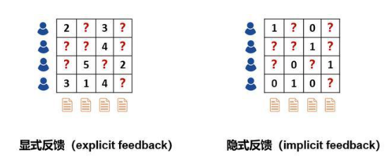

# 1 当知识图谱遇上个性化推荐

## 1、推荐系统的任务和难点

**推荐问题的本质是代替用户评估其从未看过、接触过或者使用过的物品**

推荐系统一般分为两类：

- **评分预测**：预测用户对物品的评价。比如在电影推荐中，系统需要预测用户对电影的评分，并以此为根据推送给用户可能喜欢的电影。这种场景下，**我们经常使用的数据是用户对历史观看过的电影的评分数据，这些信息可以表达用户对电影的喜好程度，因此也叫做显式反馈（explicit feedback）。**
- **点击率预估**：预测用户对于物品是否点击。比如在新闻推荐中，系统需要预测用户点击某新闻的概率来优化推荐方案。这种场景下常常使用的信息是**用户的历史点击信息。这种信息只能表达用户的行为特征(点击／未点击），而不能反映用户的喜好程度，因此这种信息也叫做隐式反馈（implicit feedback）。**

**传统的推荐系统使用显式／隐式信息作为输入来进行预测，存在两个主要的问题：**
- **稀疏性问题**：实际场景中，用户和物品的交互信息往往是非常稀疏的。如电影推荐中，电影往往成千上万部，但是用户打过分的电影往往只有几十部。使用如此少的观测数据来预测大量的未知信息，会极大增加过拟合的风险。
- **冷启动问题**：对于新加入的用户或者物品，其没有对应的历史信息，因此难以准确的进行建模和推荐。

解决稀疏性和冷启动问题的一个常见思路是在推荐算法中额外引入一些辅助信息（side information）作为输入。辅助信息可以丰富对用户和物品的描述、增强推荐算法的挖掘能力，从而有效地弥补交互信息的稀疏或缺失。常见的辅助信息包括：

- **社交网络**：一个用户对某个物品感兴趣，他的朋友可能也会对该物品感兴趣
- **用户/物品属性**：拥有同种属性的用户可能会对同一类物品感兴趣
- **图像/视频/音频/文本等多媒体信息**：例如商品图片、电影预告片、音乐、新闻标题等
- **上下文信息**：用户-物品交互的时间、地点、当前会话信息等。

近年来，**知识图谱(knowledge graph)作为一种新兴的辅助信息，逐渐引起了学者们的关注**它是如何帮助提升推荐性能的，我们来一探究竟。

## 2、什么是知识图谱

知识图谱于2012年5月17日由Google正式提出，其初衷是为了提高搜索引擎的能力，改善用户的搜索质量以及搜索体验。**随着人工智能的技术发展和应用，知识图谱逐渐成为关键技术之一，现已被广泛应用于智能搜索、智能问答、个性化推荐、内容分发等领域。**

知识图谱的官方定义如下：知识图谱是Google用于增强其搜索引擎功能的知识库。本质上, 知识图谱旨在描述真实世界中存在的各种实体或概念及其关系,其构成一张巨大的语义网络图，节点表示实体或概念，边则由属性或关系构成。（来自维基百科）。

知识图谱中包含的节点如下：
实体: 指的是具有可区别性且独立存在的某种事物。如某一个人、某一个城市、某一种植物等、某一种商品等等。世界万物由具体事物组成，此指实体。如图1的“中国”、“美国”、“日本”等。，实体是知识图谱中的最基本元素，不同的实体间存在不同的关系。
语义类（概念）：具有同种特性的实体构成的集合，如国家、民族、书籍、电脑等。 概念主要指集合、类别、对象类型、事物的种类，例如人物、地理等。
内容: 通常作为实体和语义类的名字、描述、解释等，可以由文本、图像、音视频等来表达。
属性(值): 从一个实体指向它的属性值。不同的属性类型对应于不同类型属性的边。属性值主要指对象指定属性的值。如图1所示的“面积”、“人口”、“首都”是几种不同的属性。属性值主要指对象指定属性的值，例如960万平方公里等。
关系: 形式化为一个函数，它把 k k个点映射到一个布尔值。在知识图谱上，关系则是一个把k k个图节点(实体、语义类、属性值)映射到布尔值的函数。
三元组是知识图谱的一种通用表示方式，其基本形式主要包括(实体1-关系-实体2)和(实体-属性-属性值)等。如下面的例子，中国是一个实体，北京是一个实体，中国-首都-北京 是一个（实体-关系-实体）的三元组样例。北京是一个实体 ，人口是一种属性2069.3万是属性值。北京-人口-2069.3万构成一个（实体-属性-属性值）的三元组样例。

3、知识图谱的优势
知识图谱包含了实体之间丰富的语义关联，为推荐系统提供了潜在的辅助信息来源。将知识图谱引入推荐系统中，可以给推荐系统带来以下的特性：
精确性：知识图谱为物品引入了更多的语义关系，可以深层次地发现用户兴趣。

多样性：通过知识图谱中不同的关系链接种类，有利于推荐结果的发散。

可解释性：知识图谱可以连接用户的历史记录和推荐结果，从而提高用户对推荐结果的满意度和接受度，增强用户对推荐系统的信任。

4、知识图谱与推荐系统相结合的方法
4.1 基于特征的推荐方法
基于特征的推荐方法，主要是从知识图谱中抽取一些用户和物品的属性作为特征，放入到传统模型中，如FM模型、LR模型等等。这并非是专门针对知识图谱设计，同时也无法引入关系特征。
4.2 基于路径的推荐方法
基于路径的推荐方法，以港科大KDD 2017的录用论文《Meta-Graph Based Recommendation Fusion over Heterogeneous Information Networks》为代表。我们在后面也将一起学习这篇文章。
该类方法将知识图谱视为一个异构信息网络（heterogeneous information network），然后构造物品之间的基于meta-path或meta-graph的特征。简单地说，meta-path是连接两个实体的一条特定的路径，比如“演员->电影->导演->电影->演员”这条meta-path可以连接两个演员，因此可以视为一种挖掘演员之间的潜在关系的方式。这类方法的优点是充分且直观地利用了知识图谱的网络结构，缺点是需要手动设计meta-path或meta-graph，这在实践中难以到达最优；同时，该类方法无法在实体不属于同一个领域的场景（例如新闻推荐）中应用，因为我们无法为这样的场景预定义meta-path或meta-graph。
4.3 知识图谱特征学习Knowledge Graph Embedding
知识图谱特征学习（Knowledge Graph Embedding）为知识图谱中的每个实体和关系学习得到一个低维向量，同时保持图中原有的结构或语义信息。一般而言，知识图谱特征学习的模型分类两类：基于距离的翻译模型和基于语义的匹配模型。
基于距离的翻译模型（distance-based translational models）
这类模型使用基于距离的评分函数评估三元组的概率，将尾节点视为头结点和关系翻译得到的结果。这类方法的代表有TransE、TransH、TransR等；

上面三个方法的基本思想都是一样的，我们以TransE为例来介绍一下这些方法的核心思想。在空间中，三元组的头节点h、关系r、尾节点t都有对应的向量，我们希望的是h + r = t，如果h + r的结果和t越接近，那么我们认为这些向量能够很好的表示知识图谱中的实体和关系。
基于语义的匹配模型（semantic-based matching models）
类模型使用基于相似度的评分函数评估三元组的概率，将实体和关系映射到隐语义空间中进行相似度度量。这类方法的代表有SME、NTN、MLP、NAM等。

上述方法的核心是构造一个二分类模型，将h、r和t输入到网络中，如果(h,r,t)在知识图谱中真实存在，则应该得到接近1的概率，如果不存在，应该得到接近0的概率。
结合知识图谱特征学习的推荐系统
知识图谱特征学习与推荐系统相结合，往往有以下几种方式：依次训练、联合训练、交替训练。

依次训练的方法主要有：Deep Knowledge-aware Network(DKN)
联合训练的方法主要有：Ripple Network
交替训练主要采用multi-task的思路，主要方法有：Multi-task Learning for KG enhanced Recommendation (MKR)

作者：文哥的学习日记
链接：https://www.jianshu.com/p/6a5e796499e8
来源：简书
简书著作权归作者所有，任何形式的转载都请联系作者获得授权并注明出处。