# 1 当知识图谱遇上个性化推荐

## 1、推荐系统的任务和难点

**推荐问题的本质是代替用户评估其从未看过、接触过或者使用过的物品**

推荐系统一般分为两类：

- **评分预测**：预测用户对物品的评价。比如在电影推荐中，系统需要预测用户对电影的评分，并以此为根据推送给用户可能喜欢的电影。这种场景下，**我们经常使用的数据是用户对历史观看过的电影的评分数据，这些信息可以表达用户对电影的喜好程度，因此也叫做显式反馈（explicit feedback）。**
- **点击率预估**：预测用户对于物品是否点击。比如在新闻推荐中，系统需要预测用户点击某新闻的概率来优化推荐方案。这种场景下常常使用的信息是**用户的历史点击信息。这种信息只能表达用户的行为特征(点击／未点击），而不能反映用户的喜好程度，因此这种信息也叫做隐式反馈（implicit feedback）。**
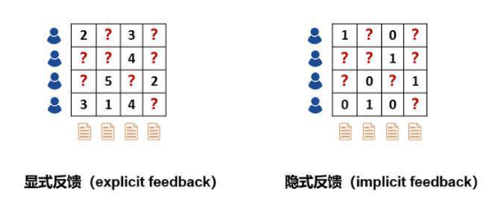
**传统的推荐系统使用显式／隐式信息作为输入来进行预测，存在两个主要的问题：**
- **稀疏性问题**：实际场景中，用户和物品的交互信息往往是非常稀疏的。如电影推荐中，电影往往成千上万部，但是用户打过分的电影往往只有几十部。使用如此少的观测数据来预测大量的未知信息，会极大增加过拟合的风险。
- **冷启动问题**：对于新加入的用户或者物品，其没有对应的历史信息，因此难以准确的进行建模和推荐。

解决稀疏性和冷启动问题的一个常见思路是在推荐算法中额外引入一些辅助信息（side information）作为输入。辅助信息可以丰富对用户和物品的描述、增强推荐算法的挖掘能力，从而有效地弥补交互信息的稀疏或缺失。常见的辅助信息包括：

- **社交网络**：一个用户对某个物品感兴趣，他的朋友可能也会对该物品感兴趣
- **用户/物品属性**：拥有同种属性的用户可能会对同一类物品感兴趣
- **图像/视频/音频/文本等多媒体信息**：例如商品图片、电影预告片、音乐、新闻标题等
- **上下文信息**：用户-物品交互的时间、地点、当前会话信息等。

近年来，**知识图谱(knowledge graph)作为一种新兴的辅助信息，逐渐引起了学者们的关注**它是如何帮助提升推荐性能的，我们来一探究竟。

## 2、什么是知识图谱

知识图谱于2012年5月17日由Google正式提出，其初衷是为了提高搜索引擎的能力，改善用户的搜索质量以及搜索体验。**随着人工智能的技术发展和应用，知识图谱逐渐成为关键技术之一，现已被广泛应用于智能搜索、智能问答、个性化推荐、内容分发等领域。**

知识图谱的官方定义如下：知识图谱是Google用于增强其搜索引擎功能的知识库。**本质上, 知识图谱旨在描述真实世界中存在的各种实体或概念及其关系,其构成一张巨大的语义网络图，节点表示实体或概念，边则由属性或关系构成**。（来自维基百科）。

知识图谱中包含的节点如下：
- **实体**: 指的是具有可区别性且独立存在的某种事物。如某一个人、某一个城市、某一种植物等、某一种商品等等。世界万物由具体事物组成，此指实体。如图1的“中国”、“美国”、“日本”等。，实体是知识图谱中的最基本元素，不同的实体间存在不同的关系。

- **语义类（概念）**：具有同种特性的实体构成的集合，如国家、民族、书籍、电脑等。 概念主要指集合、类别、对象类型、事物的种类，例如人物、地理等。

- **内容**: 通常作为实体和语义类的名字、描述、解释等，可以由文本、图像、音视频等来表达。

- **属性(值)**: 从一个实体指向它的属性值。不同的属性类型对应于不同类型属性的边。属性值主要指对象指定属性的值。如图1所示的“面积”、“人口”、“首都”是几种不同的属性。属性值主要指对象指定属性的值，例如960万平方公里等。

- **关系**: 形式化为一个函数，它把 k k个点映射到一个布尔值。在知识图谱上，关系则是一个把k k个图节点(实体、语义类、属性值)映射到布尔值的函数。

**三元组是知识图谱的一种通用表示方式，其基本形式主要包括(实体1-关系-实体2)和(实体-属性-属性值)等**

如下面的例子，中国是一个实体，北京是一个实体，中国-首都-北京 是一个（实体-关系-实体）的三元组样例。北京是一个实体 ，人口是一种属性2069.3万是属性值。北京-人口-2069.3万构成一个（实体-属性-属性值）的三元组样例。
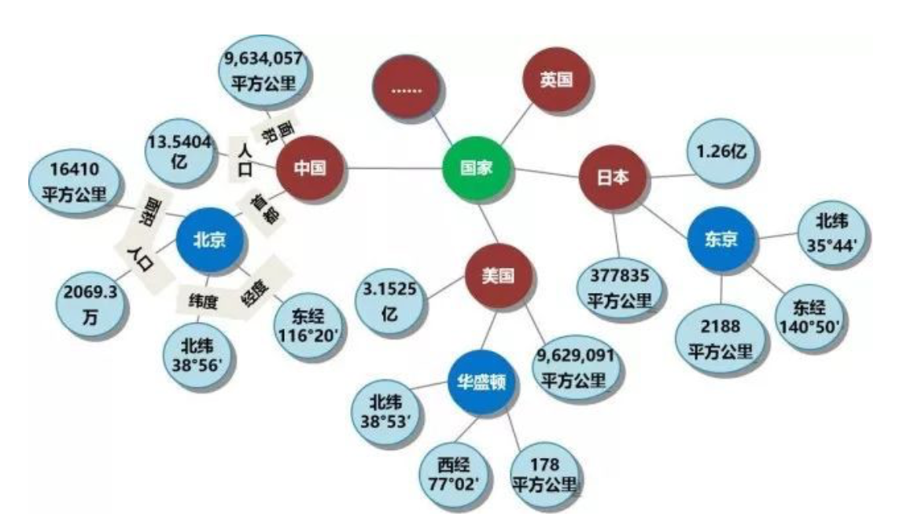

## 3、知识图谱的优势

知识图谱包含了实体之间丰富的语义关联，为推荐系统提供了潜在的辅助信息来源。将知识图谱引入推荐系统中，可以给推荐系统带来以下的特性：

- **精确性：知识图谱为物品引入了更多的语义关系，可以深层次地发现用户兴趣。**
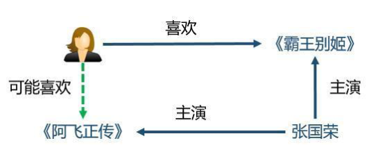

- **多样性：通过知识图谱中不同的关系链接种类，有利于推荐结果的发散。**
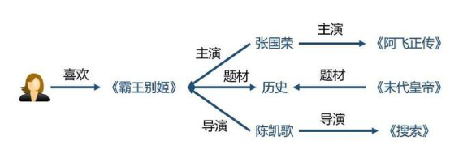

- **可解释性：知识图谱可以连接用户的历史记录和推荐结果，从而提高用户对推荐结果的满意度和接受度，增强用户对推荐系统的信任。**
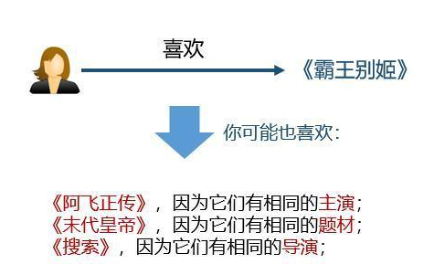

## 4、知识图谱与推荐系统相结合的方法

### 4.1 基于特征的推荐方法
**基于特征的推荐方法，主要是从知识图谱中抽取一些用户和物品的属性作为特征**，放入到传统模型中，如F**M模型、LR模型**等等。这并非是专门针对知识图谱设计，同时也无法引入关系特征。

### 4.2 基于路径的推荐方法
基于路径的推荐方法，以港科大KDD 2017的录用论文《Meta-Graph Based Recommendation Fusion over Heterogeneous Information Networks》为代表。我们在后面也将一起学习这篇文章。

该类方法将知识图谱视为一个异构信息网络（heterogeneous information network），然后构造物品之间的基于meta-path或meta-graph的特征。简单地说，meta-path是连接两个实体的一条特定的路径，比如“演员->电影->导演->电影->演员”这条meta-path可以连接两个演员，因此可以视为一种挖掘演员之间的潜在关系的方式。这类方法的优点是充分且直观地利用了知识图谱的网络结构，缺点是需要手动设计meta-path或meta-graph，这在实践中难以到达最优；同时，该类方法无法在实体不属于同一个领域的场景（例如新闻推荐）中应用，因为我们无法为这样的场景预定义meta-path或meta-graph。

### 4.3 知识图谱特征学习Knowledge Graph Embedding
**知识图谱特征学习（Knowledge Graph Embedding）为知识图谱中的每个实体和关系学习得到一个低维向量，同时保持图中原有的结构或语义信息。**一般而言，知识图谱特征学习的模型分类两类：基于距离的翻译模型和基于语义的匹配模型。

#### **基于距离的翻译模型（distance-based translational models）**

这类模型使用基于距离的评分函数评估三元组的概率，将尾节点视为头结点和关系翻译得到的结果。这类方法的代表有TransE、TransH、TransR等；
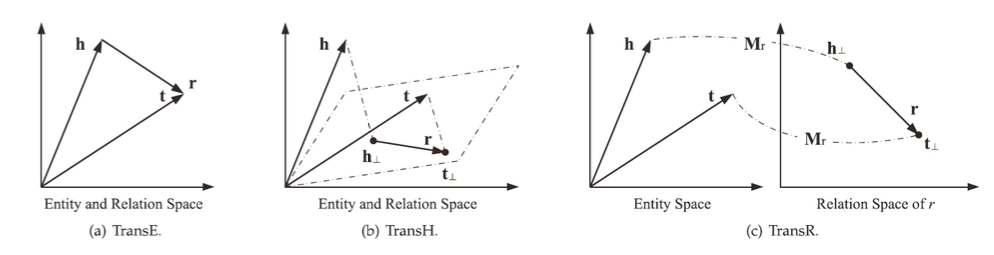

上面三个方法的基本思想都是一样的，我们以TransE为例来介绍一下这些方法的核心思想。在空间中，三元组的头节点h、关系r、尾节点t都有对应的向量，我们希望的是h + r = t，如果h + r的结果和t越接近，那么我们认为这些向量能够很好的表示知识图谱中的实体和关系。

#### **基于语义的匹配模型（semantic-based matching models）**

类模型使用基于相似度的评分函数评估三元组的概率，将实体和关系映射到隐语义空间中进行相似度度量。这类方法的代表有SME、NTN、MLP、NAM等。
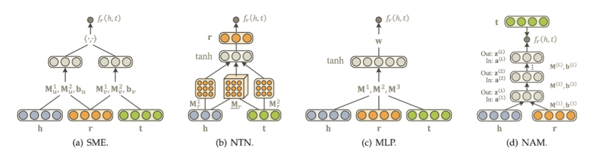

上述方法的核心是构造一个二分类模型，将h、r和t输入到网络中，如果(h,r,t)在知识图谱中真实存在，则应该得到接近1的概率，如果不存在，应该得到接近0的概率。

#### **结合知识图谱特征学习的推荐系统**

知识图谱特征学习与推荐系统相结合，往往有以下几种方式：依次训练、联合训练、交替训练。
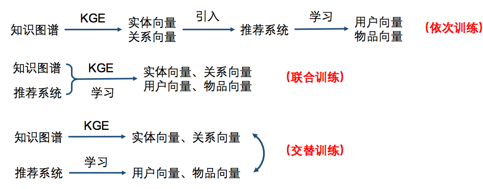
- 依次训练的方法主要有：Deep Knowledge-aware Network(DKN)
- 联合训练的方法主要有：Ripple Network
- 交替训练主要采用multi-task的思路，主要方法有：Multi-task Learning for KG enhanced Recommendation (MKR)

# 2 知识图谱与推荐系统结合之DKN模型原理及实现

我们大致介绍了一下知识图谱在推荐系统中的一些应用，我们最后讲到知识图谱特征学习(Knowledge Graph Embedding)是最常见的与推荐系统结合的方式，知识图谱特征学习为知识图谱中的每个实体和关系学习到一个低维向量，同时保持图中原有的结构或语义信息，最常见的得到低维向量的方式主要有基于距离的翻译模型和基于语义的匹配模型。

知识图谱特征学习在推荐系统中的应用步骤大致有以下三种方式：

- 依次训练的方法主要有：**Deep Knowledge-aware Network(DKN)**
- 联合训练的方法主要有：**Ripple Network**
- 交替训练主要采用multi-task的思路，主要方法有：**Multi-task Learning for KG enhanced Recommendation (MKR)**

本文先来介绍**依次训练的方法Deep Knowledge-aware Network(DKN)。**

论文下载地址为：https://arxiv.org/abs/1801.08284v1

## 1、DKN原理

### 1.1 背景

推荐系统最初是为了解决互联网信息过载的问题，给用户推荐其感兴趣的内容。在新闻推荐领域，有三个突出的问题需要解决：

- 1.新闻文章具有高度的时间敏感性，它们的相关性很快就会在短时间内失效。 过时的新闻经常被较新的新闻所取代。 **导致传统的基于ID的协同过滤算法失效。**
- 2.用户在阅读新闻的时候是带有明显的倾向性的，一般一个用户阅读过的文章会属于某些特定的主题，**如何利用用户的阅读历史记录去预测其对于候选文章的兴趣是新闻推荐系统的关键 。**
- 3.**新闻类文章的语言都是高度浓缩的，包含了大量的知识实体与常识。**用户极有可能选择阅读与曾经看过的文章具有紧密的知识层面的关联的文章。**以往的模型只停留在衡量新闻的语义和词共现层面的关联上，很难考虑隐藏的知识层面的联系。**
因此，**Deep Knowledge-aware Network(DKN)模型中加入新闻之间知识层面的相似度量，来给用户更精确地推荐可能感兴趣的新闻。**

### 1.2 基础概念

#### 1.2.1 知识图谱特征学习（Knowledge Graph Embedding）

知识图谱特征学习（Knowledge Graph Embedding）为知识图谱中的每个实体和关系学习得到一个低维向量，同时保持图中原有的结构或语义信息。一般而言，知识图谱特征学习的模型分类两类：基于距离的翻译模型和基于语义的匹配模型。

**基于距离的翻译模型（distance-based translational models）**
这类模型使用基于距离的评分函数评估三元组的概率，将尾节点视为头结点和关系翻译得到的结果。这类方法的代表有TransE、TransH、TransR等；

上面三个方法的基本思想都是一样的，我们以TransE为例来介绍一下这些方法的核心思想。在空间中，三元组的头节点h、关系r、尾节点t都有对应的向量，我们希望的是h + r = t，如果h + r的结果和t越接近，那么我们认为这些向量能够很好的表示知识图谱中的实体和关系。

**基于语义的匹配模型（semantic-based matching models）**

类模型使用基于相似度的评分函数评估三元组的概率，将实体和关系映射到隐语义空间中进行相似度度量。这类方法的代表有SME、NTN、MLP、NAM等。

上述方法的核心是构造一个二分类模型，将h、r和t输入到网络中，如果(h,r,t)在知识图谱中真实存在，则应该得到接近1的概率，如果不存在，应该得到接近0的概率。

#### 1.2.2 基于CNN的句子特征提取

DKN中提取句子特征的CNN源自于Kim CNN，用句子所包含词的词向量组成的二维矩阵，经过一层卷积操作之后再做一次max-over-time的pooling操作得到句子向量，如下图所示：
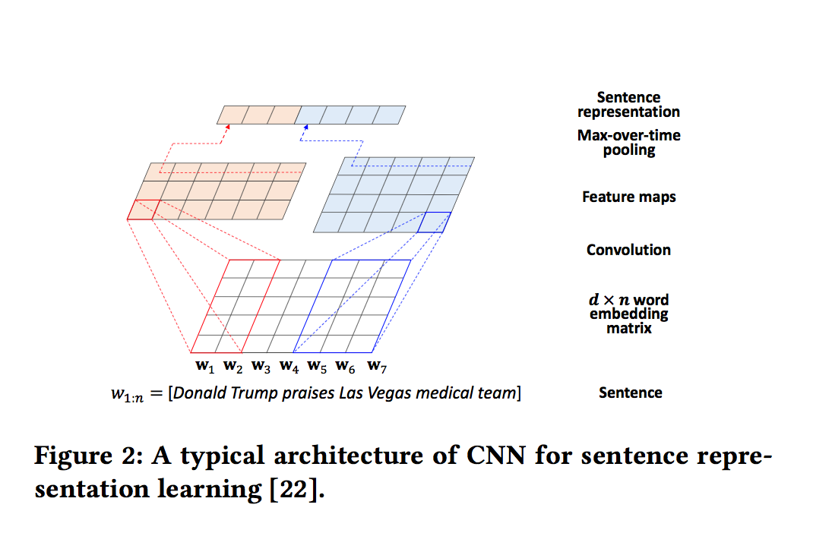

### 1.3 问题定义

给定义一个用户useri,他的点击历史记为{t1,t2,t3,....,tN}是该用户过去一段时间内层点击过的新闻的标题，N代表用户点击过新闻的总数。每个标题都是一个词序列t={w1,w2,w3,....,wn},标题中的单词有的对应知识图谱中的一个实体 。举例来说，标题《Trump praises Las Vegas medical team》其中Trump与知识图谱中的实体“Donald Trump”对应，Las和Vegas与实体Las Vegas对应。本文要解决的问题就是给定用户的点击历史，以及标题单词和知识图谱中实体的关联，我们要预测的是：一个用户i是否会点击一个特定的新闻tj。

### 1.4 模型框架
DKN模型的整体框架如下：
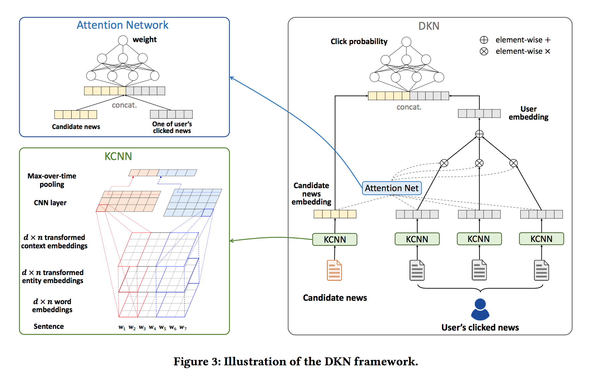

可以看到，DKN的网络输入有两个：候选新闻集合，用户点击过的新闻标题序列。输入数据通过KCNN来提取特征，之上是一个attention层，计算候选新闻向量与用户点击历史向量之间的attention权重，在顶层拼接两部分向量之后，用DNN计算用户点击此新闻的概率。接下来，我们介绍一下DKN模型中的一些细节。

#### 1.4.1 知识提取（Knowledge Distillation知识蒸馏）

知识提取过程有三方面:
一是得到标题中每个单词的embedding，
二是得到标题中每个单词对应的实体的embedding。
三是得到每个单词的上下文embedding。
**每个单词对应的embedding可以通过word2vec预训练的模型得到。这里我们主要讲后两部分。**

##### 实体embedding

实体特征即标题中每个单词对应的实体的特征表示，通过下面四个步骤得到：
- 识别出标题中的实体并利用实体链接技术消除歧义
- 根据已有知识图谱，得到与标题中涉及的实体链接在一个step之内的所有实体所形成的子图。
- 构建好知识子图以后，利用基于距离的翻译模型得到子图中每个实体embedding。
- 得到标题中每个单词对应的实体embedding。

过程图示如下：
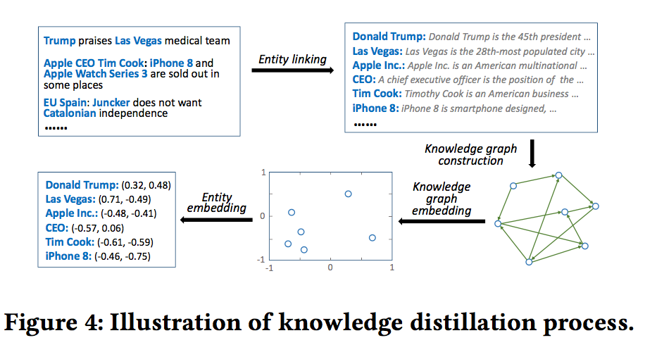

##### 上下文embedding

尽管目前现有的**知识图谱特征学习方法得到的向量保存了绝大多数的结构信息，但还有一定的信息损失，为了更好地利用一个实体在原知识图谱的位置信息，文中还提到了利用一个实体的上下文来进一步的刻画每个实体**，具体来说，**即用每个实体相连的实体embedding的平均值来进一步刻画每个实体，计算公式如下：**

$$
\overline{\mathbf{e}}=\frac{1}{|\operatorname{context}(e)|} \sum_{e_{i} \in \operatorname{context}(e)} \mathbf{e}_{i}
$$

图示如下：
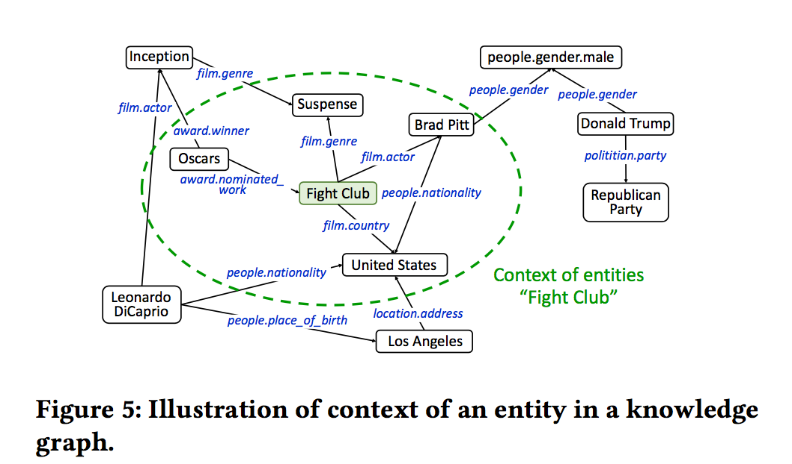

#### 1.4.2 新闻特征提取KCNN(Knowledge-aware CNN)

在知识抽取部分，我们得到了三部分的embedding，一种最简单的使用方式就是直接将其拼接：

$$
\mathbf{W}=\left[\mathbf{w}_{1} \mathbf{w}_{2} \ldots \mathbf{w}_{n} \mathbf{e}_{t_{1}} \mathbf{e}_{t_{2}} \ldots\right]
$$

但这样做存在几方面的限制：

- 连接策略打破了单词和相关实体之间的联系，并且不知道它们的对齐方式。
- 单词的embedding和对应实体的embedding是通过不同的方法学习的，这意味着它们不适合在单个向量空间中将它们一起进行卷积操作。
- 连接策略需要单词的embedding和实体的embedding具有相同的维度，这在实际设置中可能不是最优的，因为词和实体embedding的最佳维度可能彼此不同。

因此**本文使用的是multi-channel和word-entity-aligned KCNN**。具体做法是**先把实体的embedding和实体上下文embedding映射到一个空间里，映射的方式可以选择线性方式g(e) = Me，也可以选择非线性方式g(e) = tanh(Me + b)**，这样我们就可以拼接三部分作为KCNN的输入：

$$
\mathbf{W}=\left[\left[\mathbf{w}_{1} g\left(\mathbf{e}_{1}\right) g\left(\overline{\mathbf{e}}_{1}\right)\right]\left[\mathbf{w}_{2} g\left(\mathbf{e}_{2}\right) \overline{g}\left(\mathbf{e}_{2}\right)\right] \ldots\left[\mathbf{e}_{n} g\left(\mathbf{e}_{n}\right) g\left(\overline{\mathbf{e}}_{n}\right)\right]\right] \in \mathbb{R}^{d \times n \times 3}
$$

KCNN的过程我们之前已经介绍过了，这里就不再赘述。

#### 1.4.3  基于注意力机制的用户兴趣预测

**获取到用户点击过的每篇新闻的向量表示以后，作者并没有简单地作加和来代表该用户，而是计算候选文档对于用户每篇点击文档的attention，再做加权求和，计算attention**：

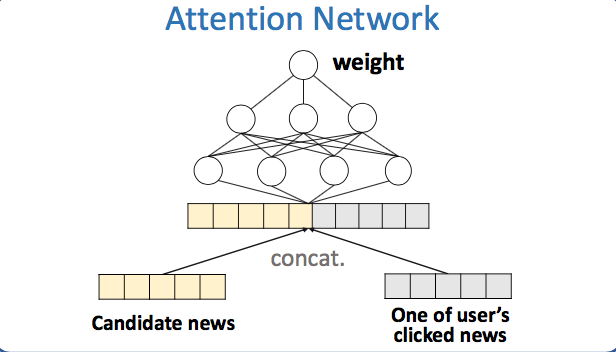

### 1.5 实验结果

本文的数据来自**bing新闻的用户点击日志，包含用户id，新闻url，新闻标题，点击与否（0未点击，1点击）**。搜集了2016年10月16日到2017年7月11号的数据作为训练集。2017年7月12号到8月11日的数据作为测试集合。使用的知识图谱数据是Microsoft Satori。以下是一些基本的统计数据以及分布：
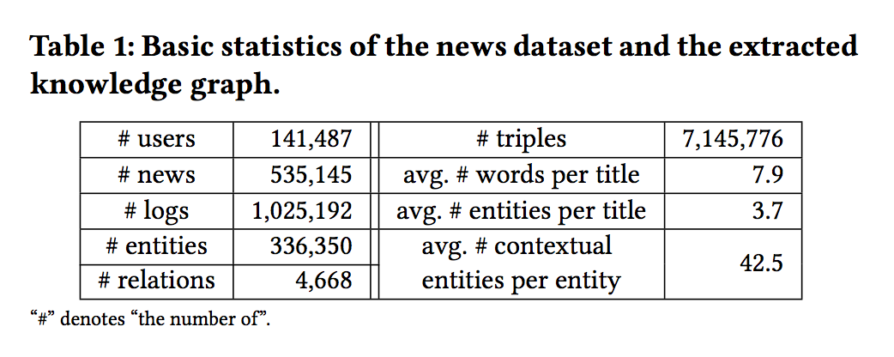

本文将DKN与FM、KPCNN、DSSM、Wide&Deep、DeepFM等模型进行对比试验，结果如下：
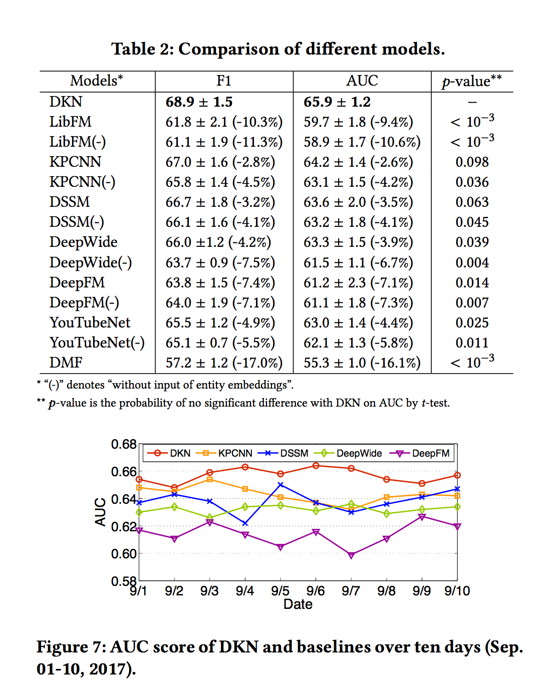

随后，本文根据DKN中是否使用上下文实体embedding、使用哪种实体embedding计算方法、是否对实体embedding进行变换、是否使用attention机制等进行了对比试验，结果如下：
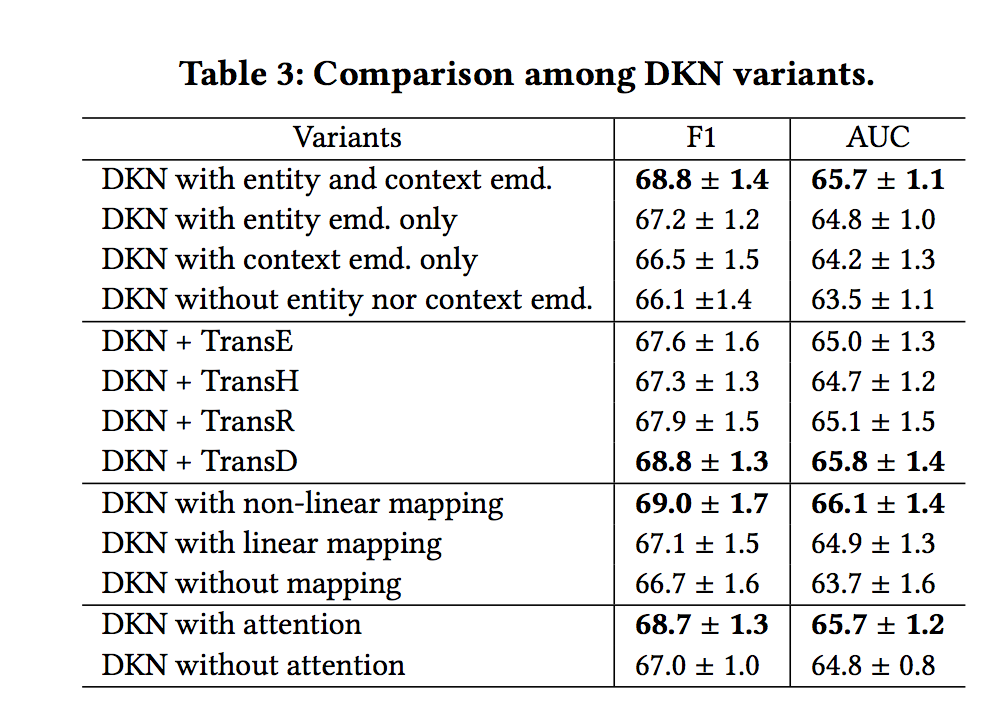

**实验表明，在使用DKN模型时，同时使用实体embedding和上下文embedding、使用TransD方法、使用非线性变换、使用attention机制可以获得更好的预测效果。**

## 2、DKN模型tensorflow实现
接下来我们就来看一下DKN模型的tensorflow实现。本文的代码地址：https://github.com/princewen/tensorflow_practice/tree/master/recommendation/Basic-DKN-Demo
参考的代码地址为：https://github.com/hwwang55/DKN