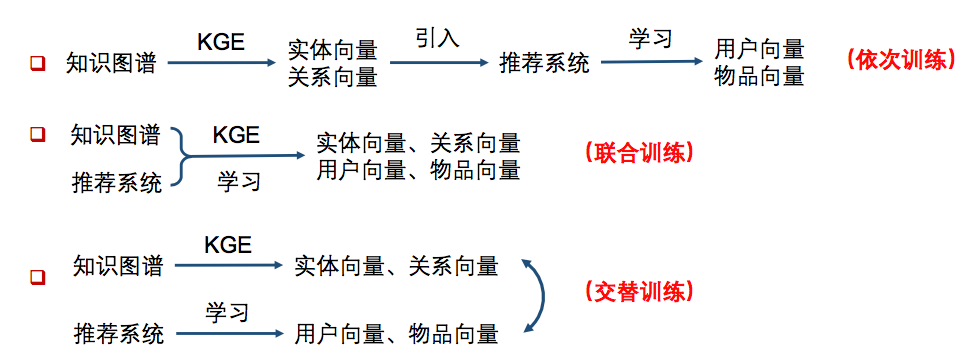
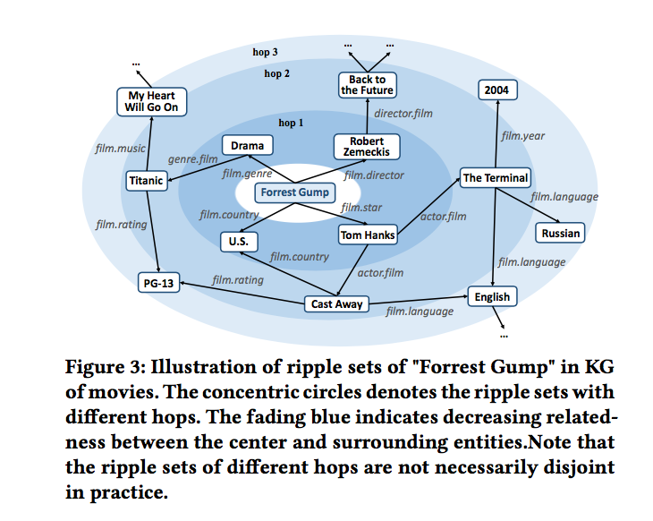
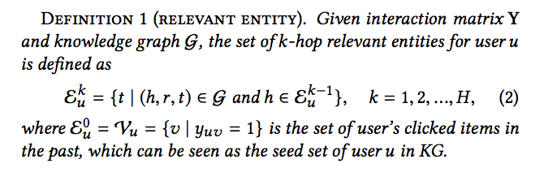
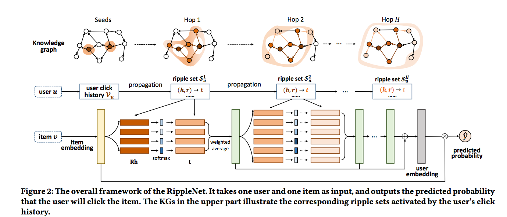

知识图谱特征学习在推荐系统中的应用步骤大致有以下三种方式：

- 依次训练的方法主要有：Deep Knowledge-aware Network(DKN)
- 联合训练的方法主要有：Ripple Network
- 交替训练主要采用multi-task的思路，主要方法有：Multi-task Learning for KG enhanced Recommendation (MKR)

本文先来介绍联合训练的方法Ripple Network。

论文下载地址为：https://arxiv.org/abs/1803.03467

# 1、RippleNet原理

## 1.1 RippleNet背景

在上一篇中我们介绍了Deep Knowledge-aware Network(DKN)，**在DKN中，我们需要首先学习到entity的向量和relation的向量，但是学习到的向量，其目的是为了还原知识图谱中的三元组关系，而并非是为了我们的推荐任务而学习的**。因此今天我们来介绍一下**知识图谱和推荐系统进行联合训练的一种网络结构：RippleNet。**

Ripple是波纹的意思，**RippleNet就是模拟用户兴趣在知识图谱上的一个传播过程，如下图所示：**

如上图，**用户的兴趣以其历史记录为中心，在知识图谱上逐层向外扩散，而在扩散过程中不断的衰减，类似于水中的波纹，因此称为RippleNet。**

## 1.2 RippleNet网络结构

我们先来介绍两个相关的定义：
**Relevant Entity**：在给定知识图谱的情况下，用户u的k-hop相关实体定义如下

特别地，用户u的0-hop相关实体即用户的历史记录。

**Ripple Set**：用户u的k-hop ripple set被定义为以k-1 Relevant Entity 为head的相关三元组：

这里，为避免Ripple Set过大，一般都会设定一个最大的长度，进行截断。另一方面，构建的知识图谱都是有向图，只考虑点的出度。

接下来，我们来看看RippleNet的网络结构：

可以看到，最终的预测值是通过item embedding和user embedding得到的，item embedding通过embedding 层可以直接得到，关键是user embedding的获取。user embedding是通过图中的绿色矩形表示的向量相加得到的，接下来，我们以第一个绿色矩形表示的向量为例，来看一下具体是如何计算的。

- 第一个绿色矩形表示的向量，需要使用的是1-hop的ripple set，对于set中的每一个(h,r,t)，会计算一个与item-embedding的相关性，相关性计算公式如下：
$$
p_{i}=\operatorname{softmax}\left(\mathbf{r}^{\mathrm{T}} \mathbf{R}_{i} \mathbf{h}_{i}\right)=\frac{\exp \left(\mathbf{v}^{\mathrm{T}} \mathbf{R}_{i} \mathbf{h}_{i}\right)}{\sum_{(h, r, t) \in \mathcal{S}_{u}^{1}} \exp \left(\mathbf{v}^{\mathrm{T}} \mathbf{R} \mathbf{h}\right)}
$$
- 最后通过加权所有t对应的embedding，就得到了第一个绿色矩形表示的向量，表示用户兴趣经第一轮扩散后的结果：
$$
\mathbf{o}_{u}^{1}=\sum_{\left(h_{i}, r_{i}, t_{i}\right) \in \mathcal{S}_{u}^{1}} p_{i} \mathbf{t}_{i}
$$
- 接下来，我们重复上面的过程，假设一共H次，那么最终user embedding的结果为：
$$
\mathbf{u}=\mathbf{o}_{u}^{1}+\mathbf{o}_{u}^{2}+\ldots+\mathbf{o}_{u}^{H}
$$
- 而最终的预测值计算如下：
$$
\hat{y}_{u v}=\sigma\left(\mathbf{u}^{\mathrm{T}} \mathbf{v}\right)
$$
## 1.3 RippleNet损失函数

在给定知识图谱G，用户的隐式反馈(即用户的历史记录)Y时，我们希望最大化后验概率：
$$
\max p(\Theta | \mathcal{G}, \mathrm{Y})
$$
后验概率展开如下：
$$
p(\Theta | \mathcal{G}, \mathrm{Y})=\frac{p(\Theta, \mathcal{G}, \mathrm{Y})}{p(\mathcal{G}, \mathrm{Y})} \propto p(\Theta) \cdot p(\mathcal{G} | \Theta) \cdot p(\mathrm{Y} | \Theta, \mathcal{G})
$$
其中，我们认为参数的先验概率服从0均值的正态分布：
$$
p(\Theta)=\mathcal{N}\left(0, \lambda_{1}^{-1} \mathbf{I}\right)
$$
第二项的似然函数形式如下：
$$
\begin{aligned} p(\boldsymbol{G} | \Theta) &=\prod_{(h, r, t) \in \mathcal{E} \times \mathcal{R} \times \mathcal{E}} p((h, r, t) | \Theta) \\ &=\prod_{(h, r, t) \in \mathcal{E} \times \mathcal{R} \times \mathcal{E}} \mathcal{N}\left(I_{h, r, t}-\mathbf{h}^{\mathrm{T}} \mathbf{R} \mathbf{t}, \lambda_{2}^{-1}\right) \end{aligned}
$$
上面的式子搞得我有点懵，后面应该是一个具体的概率值而不是一个正态分布，G在θ条件下的分布也是一个0均值的正态分布，后面应该是取得Ih,r,t-hTRt的一个概率，由于我们希望我们得到的指数图谱特征表示能够更好的还原三元组关系，因此希望Ih,r,t-hTRt越接近0越好。

第三项没什么问题，即我们常用的二分类似然函数：
$$
p(\mathrm{Y} | \Theta, \mathcal{G})=\prod_{(u, v) \in \mathrm{Y}} \sigma\left(\mathbf{u}^{\mathrm{T}} \mathbf{v}\right)^{y_{u v}} \cdot\left(1-\sigma\left(\mathbf{u}^{\mathrm{T}} \mathbf{v}\right)\right)^{1-y_{u v}}
$$
因此，我们可以得到RippleNet的损失函数形式如下：
$$
\begin{aligned} \min \mathcal{L}=&-\log (p(\mathrm{Y} | \Theta, \mathcal{G}) \cdot p(\mathcal{G} | \Theta) \cdot p(\Theta)) \\=& \sum_{(u, v) \in \mathrm{Y}}-\left(y_{u v} \log \sigma\left(\mathbf{u}^{\mathrm{T}} \mathbf{v}\right)+\left(1-y_{u v}\right) \log \left(1-\sigma\left(\mathbf{u}^{\mathrm{T}} \mathbf{v}\right)\right)\right) \\ &+\frac{\lambda_{2}}{2} \sum_{r \in \mathcal{R}}\left\|\mathbf{I}_{r}-\mathbf{E}^{\mathrm{T}} \mathbf{R E}\right\|_{2}^{2}+\frac{\lambda_{1}}{2}\left(\|\mathbf{V}\|_{2}^{2}+\|\mathbf{E}\|_{2}^{2}+\sum_{r \in \mathcal{R}}\|\mathbf{R}\|_{2}^{2}\right) \end{aligned}
$$

# 2、RippleNet的Tensorflow实现

本文的代码地址如下：https://github.com/princewen/tensorflow_practice/tree/master/recommendation/Basic-RippleNet-Demo

参考的代码地址为：https://github.com/hwwang55/RippleNet

在对数据进行预处理后，我们得到了两个文件：kg_final.txt和rating_final.txt