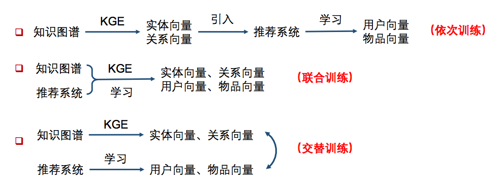
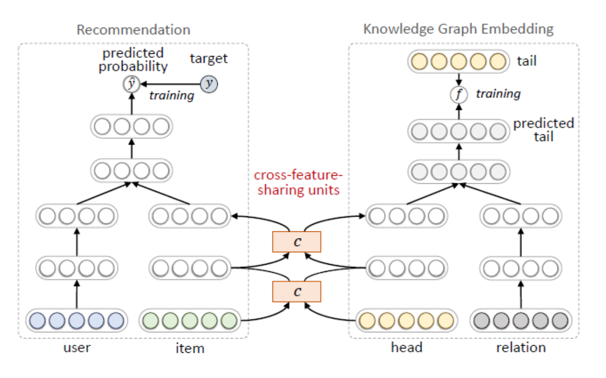
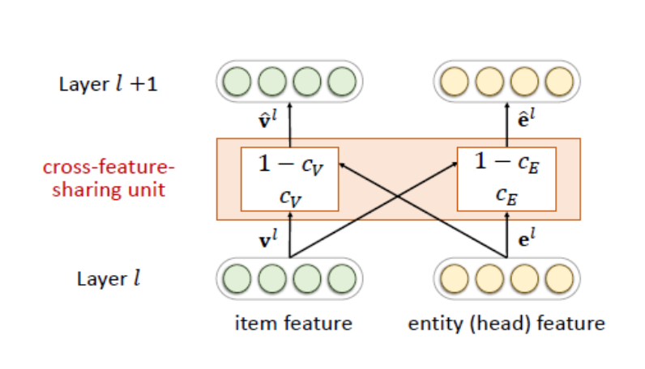

知识图谱特征学习在推荐系统中的应用步骤大致有以下三种方式：

- 依次训练的方法主要有：Deep Knowledge-aware Network(DKN)
- 联合训练的方法主要有：Ripple Network
- 交替训练主要采用multi-task的思路，主要方法有：Multi-task Learning for KG enhanced Recommendation (MKR)

本文先来介绍交替训练的方法MKR。
网上没有找到相关的论文，只有在一篇帖子里有所介绍，github上可以找到源代码进行学习。

# 1、MKR原理介绍

由于**推荐系统中的物品和知识图谱中的实体存在重合**，因此**可以采用多任务学习的框架，将推荐系统和知识图谱特征学习视为两个分离但是相关的任务，进行交替式的学习。**

**MKR的模型框架如下图，其中左侧是推荐系统任务，右侧是知识图谱特征学习任务。推荐部分的输入是用户和物品的特征表示，点击率的预估值作为输出。知识图谱特征学习部分使用的是三元组的头节点和关系作为输入，预测的尾节点作为输出**：

**由于推荐系统中的物品和知识图谱中的实体存在重合，所以两个任务并非相互独立。所以作者在两个任务中设计了交叉特征共享单元（cross-feature-sharing units）作为两者的连接纽带。**

**交叉特征共享单元是一个可以让两个任务交换信息的模块**。由于物品向量和实体向量实际上是对同一个对象的两种描述，他们之间的信息交叉共享可以让两者都获得来自对方的额外信息，从而弥补了自身的信息稀疏性的不足，其结构如下：

关于这个交叉单元具体实现，大家可以参照代码进行理解。

最后是损失函数部分，由于是交替训练的方式，所以在训练时首先固定推荐系统模块的参数，训练知识图谱特征学习模块的参数；然后固定知识图谱特征学习模块的参数，训练推荐系统模块的参数。

**推荐系统模块是点击率预估模型，损失函数是对数损失加l2正则项；知识图谱特征学习模块希望预测得到的tail向量和真实的tail向量相近，因此首先计算二者的内积（内积可近似表示向量之间的余弦相似度），内积经过sigmoid之后取相反数，再加上l2正则项，即得到了知识图谱特征学习模块的损失。关于损失的计算，我们在代码里可以更清楚的看到。**

# 2、MKR模型tensorflow实现

本文的代码地址为：https://github.com/princewen/tensorflow_practice/tree/master/recommendation/Basic-MKR-Demo

参考代码地址为：https://github.com/hwwang55/MKR