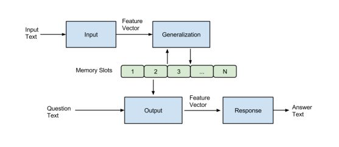
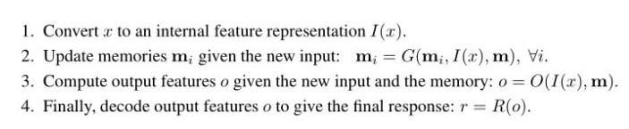
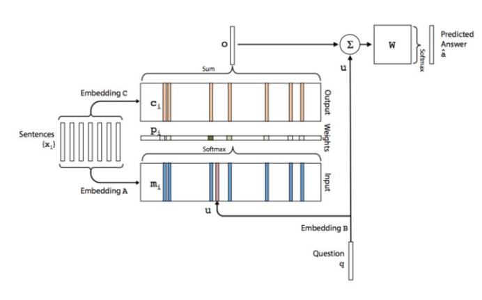
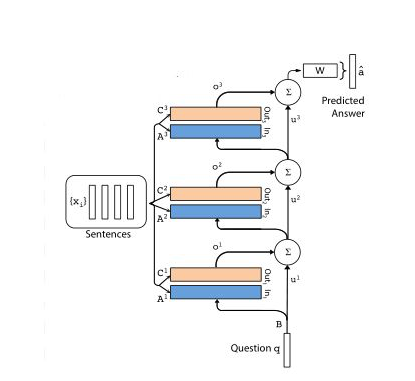
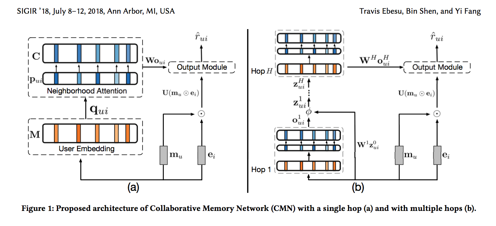
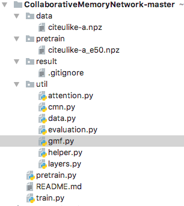

**协同过滤(collaborative filtering)是推荐系统中经典的一类方法。协同过滤中比较经典的解法有基于邻域方法、矩阵分解等，这些方法都有各自的优点和缺点，本文介绍的方法-协同记忆网络(Collaborative Memory Network，简称CMN)融合了不同协同过滤方法的优点。我们来一探究竟！**

# 1、协同过滤介绍

**在信息过载的时代，推荐系统显得十分重要。而在推荐系统中，协同过滤是一种非常受欢迎且有效的方法。协同过滤基于用户和物品的过去交互行为，同时认为相似的用户会消费相似的物品，从而进行推荐。**

**协同过滤是一类推荐方法**，大体上可以分为三个分支：

- **基于邻域的方法**。这也是我们常说的**基于物品的协同过滤和基于用户的协同过滤方法**。我们首**先需要计算用户之间、物品之间的相似度，随后基于计算的相似度进行推荐。**这种方法的一个主要缺陷就是**只使用了局部的结构，而忽略了很多全局的信息**，因为我们**只使用K个相似用户或者相似物品进行相关的推荐**。

- **基于隐向量的方法**。这一分支中**最具代表性的是矩阵分解及后面的各种改进方法**。通常的做法是**将每一个用户和物品表示称一个n维的向量，通过用户矩阵和物品矩阵的相乘，希望能够尽可能还原评分矩阵。这种做法虽然考虑了全局的信息，但是忽略了一些比较强的局部联系。**

- **基于混合模型的方法**。由于上述两种方法都有各自的缺陷，因此混合方法开始出现。**最具代表性的是因子分解机和SVD++方法。**

也就是说，**在使用协同过滤这些方法时，我们通常需要关注两点：**

- 1、需要考虑全局的信息，**充分利用整个评分矩阵**。
- 2、需要考虑局部的信息，**考虑用户或者物品之间的相似性**。**相似性高的用户或者物品给予更高的权重。**

本文将要介绍的**协同记忆网络，便是充分利用了上述两方面的信息**。协同过滤我们已经介绍了，那么什么是记忆网络呢？我们接下来进行介绍。

# 2、记忆网络Memory Network简介

Memory Network是深度学习的一个小分支，从2014年被提出到现在也逐渐发展出了几个成熟的模型。我们这里只介绍其中两个比较基础的模型。

一个是 **Basic Memory Network**，另一个是**End to End Memory Network**。

我们首先要搞清楚的是，为什么要有记忆网络？
- 在翻译、问答等领域的任务中，我们通常使用的是Seq2Seq结构，由两个循环神经网络组成。
- 循环神经网络(RNN,LSTM,GRU等)使用hidden states或者Attention机制作为他们的记忆功能，但是这种方法产生的记忆太小了，无法精确记录一段话中所表达的全部内容，也就是**在将输入编码成dense vectors的时候丢失了很多信息。因此，在模型中加入一系列的记忆单元，增强模型的记忆能力，便有了Memory Network**。

## 2.1 Basic Memory Network

基本的Memory Network由Facebook在2014年的“Memory Networks”一文中提出。该模型主要**由一个记忆数组m和I，G，O，R四个模块**。结构图如下所示：

简单来说，就是**输入的文本经过Input模块编码成向量，然后将其作为Generalization模块的输入，该模块根据输入的向量对memory进行读写操作，即对记忆进行更新**。然后Output模块会根据Question（也会进过Input模块进行编码）对memory的内容进行权重处理，将记忆按照与Question的相关程度进行组合得到输出向量，最终Response模块根据输出向量编码生成一个自然语言的答案出来。各模块作用如下：

有关记忆网络的详细原理，参考文章：https://zhuanlan.zhihu.com/p/29590286或者原论文：https://arxiv.org/pdf/1410.3916.pdf。

## 2.2 End to End Memory Network

End to End Memory Network是Memory Network的一个改进版本，可以进行端对端的学习。原文中介绍的网络模型应用于QA任务。单层网络的结构如下图所示：

模型主要的参数包括A,B,C,W四个矩阵，其中A,B,C三个矩阵就是embedding矩阵，主要是将输入文本和Question编码成词向量，W是最终的输出矩阵。从上图可以看出，对于输入的句子s分别会使用A和C进行编码得到Input和Output的记忆模块，Input用来跟Question编码得到的向量相乘得到每句话跟q的相关性，Output则与该相关性进行加权求和得到输出向量。然后再加上q并传入最终的输出层。

进一步，我们可以使用多层的结构：

有关End2End Memory Network的详细原理，可以参考文章：https://zhuanlan.zhihu.com/p/29679742和原论文：http://10.3.200.202/cache/11/03/papers.nips.cc/82b8c2ad3e5cde7cad659be2d37c251e/5846-end-to-end-memory-networks.pdf。

当然，也可以动手实现一个网络结构，参考代码：https://github.com/princewen/tensorflow_practice/tree/master/nlp/Basic-EEMN-Demo

# 3、协同记忆网络原理

我们的协同记忆网络CMN其实借鉴了End2End Memory Network的思路，我们先来看一下完整的网络结构，随后一步步进行介绍：

这里明确一点，我们的任务是预测用户u对于物品i的评分。

## 3.1 User Embedding

首先，**我们会有两组用户的Memory(其实就是Embedding)，分别是M和C，M用于计算用户之间关于某件物品i的相关性，C用于最终的输出向量。我们还有一组物品的Memory(其实就是Embedding)，我们称作E。**

对于预测用户u对于物品i的评分。我们首先会得到历史上所有跟物品i有反馈的用户集合，我们称作N(i)。接下来，我们要计算目标用户u和N(i)中每个用户的相关性，基于下面的公式：

$$
q_{u i v}=\mathbf{m}_{u}^{\top} \mathbf{m}_{v}+\mathbf{e}_{i}^{\top} \mathbf{m}_{v}
$$

其中，mu,mv分别是用户u和用户v在M中的相关记忆。ei代表物品i在E中的相关记忆。

## 3.2 Neighborhood Attention

对于上一步计算出的相关性，我们需要通过一个softmax操作转换为和为1的权重向量：

$$
p_{u i v}=\frac{\exp \left(q_{u i v}\right)}{\sum_{k \in N(i)} \exp \left(q_{u i k}\right)} \quad \forall v \in N(i)
$$

同时，根据得到的权重向量，我们根据下面的式子得到输出向量：

$$
\mathbf{o}_{u i}=\sum_{v \in N(i)} p_{u i v} \mathbf{c}_{v}
$$

其中，cv代表用户v在C中的相关记忆。

## 3.3 Output Module

最终的预测输出为：
$$
\hat{r}_{u i}=\mathbf{v}^{\top} \phi\left(\mathbf{U}\left(\mathbf{m}_{u} \odot \mathbf{e}_{i}\right)+\mathbf{W} \mathbf{o}_{u i}+\mathbf{b}\right)
$$

可以看到，在上面的式子中，括号中的第一项是用户的记忆mu和物品的记忆ei进行的element-wise 相乘操作，这相当于矩阵分解的思想，即考虑了全局的信息。第二项相当于是按照基于邻域的思路得到的一个输出向量，即考虑了局部的相关用户的信息。最终经过激活函数φ和输出层得到最终的预测评分。因此，CMN不仅考虑了全局的结构信息，还考虑了局部的相关用户的信息。

## 3.4 Multiple Hops

CMN模型可以扩展为多层。在每一层，我们的记忆是不变的，变化的主要是权重向量。每一层的权重向量计算公式如下：

$$
q_{u i v}^{h+1}=\left(\mathbf{z}_{u i}^{h}\right)^{\top} \mathbf{m}_{v} \quad \forall v \in N(i)
$$

这里冒出了一个zhui，初始的z为：

$$
\mathbf{z}_{u i}^{0}=\mathbf{m}_{u}+\mathbf{e}_{i}
$$

那么这就跟我们单层的CMN网络中的计算方式是一样的，因为内积的计算是符合乘法分配律的。
接下来每一层的z，计算公式如下：
$$
\mathbf{z}_{u i}^{h}=\phi\left(\mathbf{W}^{h} \mathbf{z}_{u i}^{h-1}+\mathbf{o}_{u i}^{h}+\mathbf{b}^{h}\right)
$$

## 3.5 Parameter Estimation
论文中**CMN网络采取的是一个pair-wise的方式**，训练时每次输入一个正样本得到一个评分，输入一个负样本得到一个评分，我们希望正样本的得分远大于负样本的得分。这种形式我们称为**Bayesian Personalized Ranking (BPR) optimization criterion**：
$$
\mathcal{L}=-\sum_{\left(u, i^{+}, i^{-}\right)} \log \sigma\left(\hat{r}_{u i^{+}}-\hat{r}_{u i^{-}}\right)
$$

好了，模型的原理我们就介绍到这里了，接下来我们看一下代码实现吧。

# 4、CMN模型的tensorflow实现

本文的代码参考地址为：
https://github.com/tebesu/CollaborativeMemoryNetwork

协同记忆网络CMN论文：https://arxiv.org/pdf/1804.10862.pdf

代码文件结构为：

该Demo中的部分神经网络结构由dm-sonnet进行了封装，可以通过 pip install dm-sonnet进行安装，默认进行安装的话，tensorflow的版本应该至少在1.8以上。
有关代码的实现细节，本文就不再介绍了，感兴趣的话，大家可以看一下这个Demo。