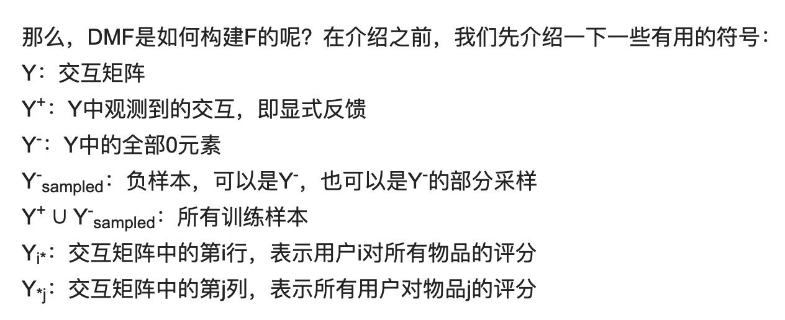
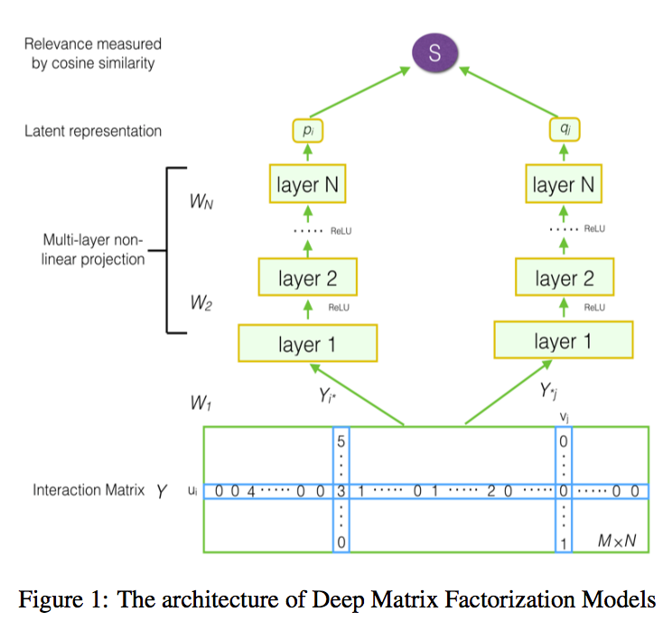
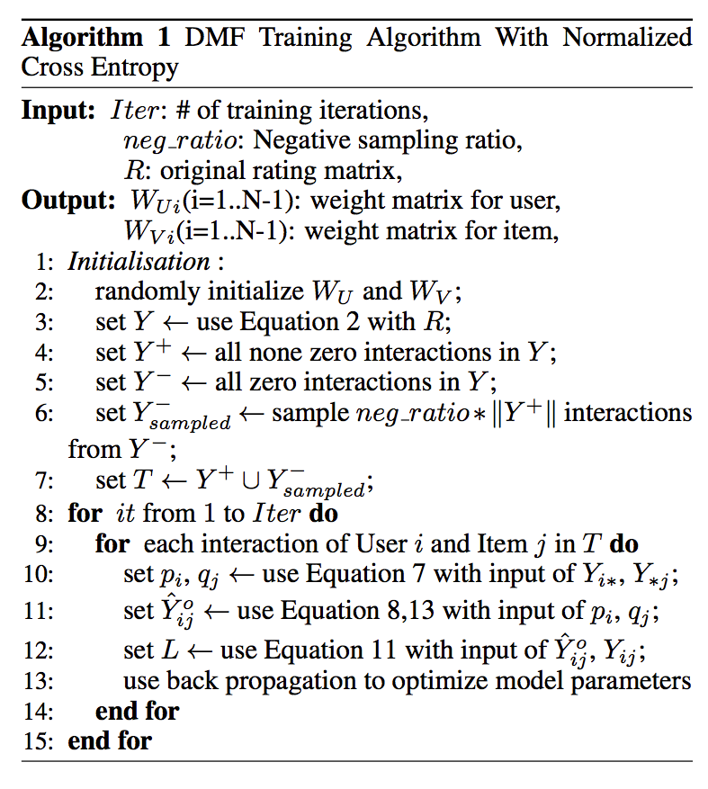

本文提出了一种基于神经网络结构的矩阵分解模型。该模型综合考虑了用户对物品的显式评分和非偏好隐式反馈，然后通过两组神经网络将用户和物品的特征提取到一个低维空间；并通过设计的新的损失函数进行反向学习。本文设计的新损失函数将显式反馈加入二元交叉熵损失函数中，称为归一化交叉熵损失。实验证明该模型在几个典型数据集上相对于其他经典模型表现更好。

论文题目为：《Deep Matrix Factorization Models for Recommender Systems》

论文地址为：https://www.ijcai.org/proceedings/2017/0447.pdf

**本文提出的模型名称为Deep Matrix Factorization Models，下文我们简称DMF**

# 1、DMF原理介绍

## 1.1 问题陈述

假设我们有M个用户以及N个物品，R是M*N的评分矩阵，Rij表示用户i对于物品j的评分。**在实际中，我们有两种方式来构造用户-物品交互矩阵Y(实际中用于训练的矩阵)：**

$$
Y_{i j}=\left\{\begin{array}{ll}{0,} & {\text { if } R_{i j}=u n k} \\ {1,} & {\text { otherwise }}\end{array}\right.
$$

$$
Y_{i j}=\left\{\begin{array}{ll}{0,} & {\text { if } \quad R_{i j}=u n k} \\ {R_{i j},} & {\text { otherwise }}\end{array}\right.
$$

大部分现有的方案中，使用(1)来构建交互矩阵Y，但本文使用(2)来构建交互矩阵。如果用户i对物品j有评分，那么Yij=Rij，此时反馈被称为显式反馈。否则的话，Yij=0，此时我们称这种反馈为**非偏好隐式反馈(non-preference implicit feedback)(个人理解是评分为0不代表用户不喜欢，可能是用户没有接触过该物品)。**

**推荐系统的任务往往是对交互矩阵中未知的部分进行评分，随后对评分的结果进行排序，我们假定评分通过一个模型来得到**：

$$
\hat{Y}_{i j}=F\left(u_{i}, v_{j} | \Theta\right)
$$

如何定义一个F呢？举例来说，隐语义模型（LFM）简单地应用pi，qj的点积来预测:

$$
\hat{Y}_{i j}=F^{L F M}\left(u_{i}, v_{j} | \Theta\right)=p_{i}^{T} q_{j}
$$

## 2.2 DMF模型

DMF模型框架如下：

可以看到，为了预测用户i对物品j的评分，用户i的输入是交互矩阵中的第i行Yi*、物品j的输入是交互矩阵中的第j列Y*j。两部分的输入分别经过两个多层神经网络得到向量pi和qj，即用户i和物品j的隐向量表示。

$$
\begin{array}{l}{p_{i}=f_{\theta_{N}^{U}}\left(\ldots f_{\theta_{3}^{U}}\left(W_{U 2} f_{\theta_{2}^{U}}\left(Y_{i *} W_{U 1}\right)\right) \ldots\right)} \\ {q_{j}=f_{\theta_{N}^{I}}\left(\ldots f_{\theta_{3}^{I}}\left(W_{V 2} f_{\theta_{2}^{I}}\left(Y_{* j}^{T} W_{V 1}\right)\right) \ldots\right)}\end{array}
$$

随后，通过pi和qj的余弦距离得到预测评分：

$$
\hat{Y}_{i j}=F^{D M F}\left(u_{i}, v_{j} | \Theta\right)=\operatorname{cosine}\left(p_{i}, q_{j}\right)=\frac{p_{i}^{T} q_{j}}{\left\|p_{i}\right\|\left\|q_{j}\right\|}
$$

论文中指出，这是第一次直接使用交互矩阵作为表示学习的输入。正如我们前面提到的，Yi*代表用户对所有物品的评分。它可以在某种程度上表明用户的全局偏好。Y*j代表了一个物品上所有用户评价。它可以在某种程度上表明一个物品的概要。论文中认为用户和项目的这些表示对于最终的低维表示非常有用。

## 2.3 损失函数设计

对于推荐系统来说，主要有两种目标函数，一是point-wise的，二是pair-wise的，本文使用point-wise的目标函数。目标函数中最重要的部分就是损失函数。

在许多现有的模型中，对于显式反馈，使用平方损失函数：
$$
L_{s q r}=\sum_{(i, j) \in Y+\cup Y^{-}} w_{i j}\left(Y_{i j}-\hat{Y}_{i j}\right)^{2}
$$

但是平方损失函数对于隐式反馈来说并不是十分有效。隐式反馈通常被视作0-1二分类问题，通常使用交叉熵损失函数：

$$
L=-\sum_{(i, j) \in Y+\cup Y^{-}} Y_{i j} \log \hat{Y}_{i j}+\left(1-Y_{i j}\right) \log \left(1-\hat{Y}_{i j}\right)
$$

本文构造的交互矩阵，既有显示评分，也有隐式反馈。而平方损失关注显式评分，而交叉熵损失则关注隐式反馈。所以本文提出了归一化交叉熵损失函数，将显式的评分合并到交叉熵损失中。该损失函数的计算公式如下：

$$
\begin{aligned} L=-& \sum_{(i, j) \in Y+\cup Y^{-}}\left(\frac{Y_{i j}}{\max (R)} \log \hat{Y}_{i j}\right.\\ &\left.+\left(1-\frac{Y_{i j}}{\max (R)}\right) \log \left(1-\hat{Y}_{i j}\right)\right) \end{aligned}
$$

max(R)是所有评分中的最大值。还有一个注意的点是，预测值不能是负数，所以我们要对负数进行处理，使其变为一个非常小的数：

$$
\hat{Y}_{i j}^{o}=\max \left(\mu, \hat{Y}_{i j}\right)
$$

综上，DMF的过程如下：

# 2、DMF代码实现

代码地址为：https://github.com/princewen/tensorflow_practice/tree/master/recommendation/Basic-DMF-Model

数据为movieslen-1m的数据：https://grouplens.org/datasets/movielens/