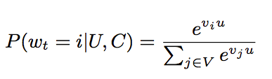

看题目，相信大家都知道本文要介绍的便是经典的Youtube的深度学习推荐系统论文《Deep Neural Networks for YouTube Recommendations》，如果你之前已经读过该文章，那我们一起来回顾讨论一下；如果你没有读过这个文章，希望本文能够起到导读的作用，能够帮助你更好的理解文章！

# 1、引言

youtube是世界上最大的视频内容平台，在如此体量的平台中，推荐系统是至关重要的。但是，youtube的视频推荐面临三方面的挑战：

- 1）**Scale**：视频和用户数量巨大，很多现有的推荐算法能够在小的数据集上表现得很好，但是在这里效果不佳。需要构建高度专业化的分布式学习算法和高效的服务系统来处理youtube庞大的用户和视频数量。
- 2）**Freshness**：这体现在两方面，**一方面视频更新频繁，另一方面用户行为更新频繁**。
- 3）**Noise**：**相较于庞大的视频库，用户的行为是十分稀疏的**，同时，我们基本上能获得的都是**用户的隐式反馈信号**。构造一个强健的系统是十分困难的。

面临如此多的挑战，youtube是如何搭建自己的推荐系统的呢？我们一起来看看。

# 2、Youtube推荐系统 整体架构

Youtube推荐系统的整体架构如下：

**由于网站视频数量太多，视频候选集太大，不宜用复杂网络直接进行推荐，这会造成响应时间的增加**。因此，整个架构走**粗排 + 精排**两阶段的路子：
- **Candidate Generation Model**：在这一步，从成百上千万的视频中**选择百量级的候选视频**
- **Ranking Model**：这一步，完成**对几百个候选视频的精排**。

接下来，我们介绍这两阶段的实现细节。

# 3、候选集生成Candidate Generation

**Candidate Generation阶段，会从巨大的视频库中挑选几百个用户可能感兴趣的候选集**。模型的结构如下图所示：

关于该架构，我们从以下几个方面进行讨论：

## 3.1 输入特征

可以看到，模型的输入包括**用户的观看过的视频的embedding，用户搜索过的token的embedding，用户的地理信息embedding，用户的年龄和性别信息**。这里有一个很有意思并且值得我们深思的特征，被称为"Example Age"。我们知道，每一秒中，YouTube都有大量视频被上传，推荐这些最新视频对于YouTube来说是极其重要的。同时，通过观察历史数据发现，用户更倾向于推荐那些尽管相关度不高但是是最新（fresh）的视频。看论文的图片，我们可能认为该特征表示视频被上传之后距现在的时间。但文章其实没有定义这个特征是如何获取到的，应该是训练时间-Sample Log的产生时间。而在线上服务阶段，该特征被赋予0值甚至是一个比较小的负数。这样的做法类似于在**广告排序中消除position bias。**

**假设这样一个视频十天前发布的，许多用户在当前观看了该视频，那么在当天会产生许多Sample Log，而在后面的九天里，观看记录不多，Sample Log也很少。**如果我们没有加入Example Age这个特征的话，无论何时训练模型，这个视频对应的分类概率都是差不多的，但是如果我们加入这个特征，模型就会知道，如果这条记录是十天前产生的话，该视频会有很高的分类概率，如果是最近几天产生的话，分类概率应该低一些，这样可以更加逼近实际的数据。实验结果也证明了这一点，参见下图：

## 3.2 样本和上下文选择

**在这里，正样本是用户所有完整观看过的视频，其余可以视作负样本。**

**训练样本是从Youtube所有的用户观看记录里产生的，而并非只是通过推荐系统产生的。**同时，针对每一个用户的观看记录，都生成了固定数量的训练样本，这样，每个用户在损失函数中的地位都是相等的，防止一小部分超级活跃用户主导损失函数。

**在对待用户的搜索历史或者观看历史时，可以看到Youtube并没有选择时序模型，而是完全摒弃了序列关系，采用求平均的方式对历史记录进行了处理。**这是因为考虑时序关系，用户的推荐结果将过多受最近观看或搜索的一个视频的影响。文章中给出一个例子，如果用户刚搜索过“tayer swift”，你就把用户主页的推荐结果大部分变成tayer swift有关的视频，这其实是非常差的体验。为了综合考虑之前多次搜索和观看的信息，YouTube丢掉了时序信息，讲用户近期的历史纪录等同看待。但是上述仅是经验之谈，也许类似阿里深度学习演化网络中RNN + Attention的方法，能够取得更好的推荐效果。

最后，**在处理测试集的时候，YouTube没有采用经典的随机留一法（random holdout），而是把用户最近的一次观看行为作为测试集**，如下图。这主要是**避免引入超越特征**。

## 3.3 离线训练

从模型结构可以看出，**在离线训练阶段，我们将其视为了一个分类问题**。我们使用隐式反馈来进行学习，用户完整观看过一个视频，便视作一个正例。如果将视频库中的每一个视频当作一个类别，那么在时刻t，对于用户U和上下文C，用户会观看视频i的概率为：

其中，u是用户的embedding，这个embedding，是网络最后一个Relu激活函数的输出，vi是视频i的embedding。那么问题来了，输入时，每一个视频也有一个对应的embedding，这个embedding是不是计算softmax的embedding呢？这里文章也没有说清楚？也许一个视频对应一个embedding，也许一个视频对应两组不同的embedding。

**使用多分类问题的一个弊端是，我们有百万级别的classes，模型是非常难以训练的**，因此在实际中**，Youtube并使用负样本采样(negative sampling)的方法，将class的数量减小**。还有一种可以替换的方法，成为**hierarchical softmax，但经过尝试，这种方法并没有取得很好的效果。**关于上面的两种方法，大家是不是**想起了word2vec中训练词向量的两种方式？但是这里的负采样和word2vec中的负采样方法是不同的，这里采样之后还是一个多分类问题，而word2vec中的负采样方法是将问题转为了一个二分类问题。**

下图是离线训练的结果，使用的评价指标**是MAP(Mean Average Precision)**，主要考察的两个点是**输入特征以及网络层数对于实验效果的影响**：

## 3.4 在线服务

**对于在线服务来说，有严格的性能要求，必须在几十毫秒内返回结果**。因此，youtube没有重新跑一遍模型，而是通过保存用户的embedding和视频的embedding，通过最近邻搜索的方法得到top N的结果

从图中可以看到，**最终的结果是approx topN的结果，所以并不是直接计算用户embedding和每个视频embedding的内积。如果这样做的话，N个视频的内积计算 + 排序，时间复杂度大概是NlogN**，这样很难满足时间复杂度要求。如果使用**局部敏感哈希(Locality-Sensitive Hashing, LSH)等近似最近邻快速查找技术，时间复杂度是可以大大降低的。**

但文中只是提到说使用hash的方法来得到近似的topN，所以也许不是局部敏感哈希方法，不过如果想要了解一下该方法的原理，可以参考博客：https://www.cnblogs.com/wt869054461/p/8148940.html

# 4、排序Ranking

**排序过程是对生成的候选集做进一步细粒度的排序**。模型的结构图如下所示：

## 4.1 输入特征

在排序阶段，输入的特征主要有：
- impression video ID embedding: 当前要计算的video的embedding
- watched video IDs average embedding: 用户观看过的最后N个视频embedding的average pooling
- language embedding: 用户语言的embedding和当前视频语言的embedding
- time since last watch: 用户上次观看同频道时间距现在的时间间隔
- previous impressions: 该视频已经被曝光给该用户的次数

前面三组特征是比较好理解的，我们重点来看一下后面两组特征的作用。
- **第4个特征是用户上次观看同频道时间距现在的时间间隔，这里有一点attention的意思，加入我们刚看了一场NBA比赛的集锦，我们很可能继续观看NBA频道的其他视频，那么这个特征就很好地捕捉到了这一行为**。
- **第5个特征previous impressions则一定程度上引入了exploration的思想，避免同一个视频持续对同一用户进行无效曝光。尽量增加用户没看过的新视频的曝光可能性。**

## 4.2 特征处理

特征处理主要包含对于离散变量的处理和连续变量的处理。

- 对于**离散变量**，这里主要是视频ID，Youtube这里的做法是有两点：
  - 1、**只保留用户最常点击的N个视频的embedding，剩余的长尾视频的embedding被赋予全0值**。可能的解释主要有两点，一是出现次数较少的视频的embedding没法被充分训练。二是也可以节省线上服务宝贵的内存资源。
  - 2、**对于相同域的特征可以共享embedding，比如用户点击过的视频ID，用户观看过的视频ID，用户收藏过的视频ID等等，这些公用一套embedding可以使其更充分的学习，同时减少模型的大小，加速模型的训练。**

- 对于**连续特征**，主要进行**归一化处理，神经网络对于输入的分布及特征的尺度是十分敏感**。因此作者设计了**一种积分函数将连续特征映射为一个服从[0,1]分布的变量**。该**积分函数**为：

个人理解就是将**概率密度分布转换成了累计密度分布。为了引入特征的非线性，除了加入归一化后的特征外，还加入了该特征的平方和开方值。**

## 4.3 建模期望观看时间

**在训练阶段，Youtube没有把问题当作一个CTR预估问题，而是通过weighted logistic 建模了用户的期望观看时间。**
在这种情况下，**对于正样本，权重是观看时间**，而**对于负样本，权重是单位权重(可以认为是1)**，那么，此时，观看时长的几率(odds，在原逻辑回归中，指正例发生的概率与负例发生概率的比值)为：

上式中，Ti指样本中第i条正样本的观看时长，N是所有的训练样本，k是正样本的个数。在k特别小的情况下，上式近似为ET，P是点击率，E[T]是视频的期望观看时长，因为P非常小，那么乘积近似于E[T]。

同时，对于逻辑回归，我们知道几率的计算公式其实就是exp(wx + b)，同时几率可以近似于期望观看时长E[T]，那么我们在测试阶段，就可以直接输出exp(wx + b)，作为期望观看时长。

离线训练的效果如下图：

# 5、总结

好了，本文就到这里了，我们一起回顾了一下Youtube的视频推荐系统，它是一个两阶段的系统。在每一个阶段，都有很多值得我们思考和学习的细节。最后，引用推荐阅读3中的十大问题，帮助你检验是否真正理解了文章的内容：

- 1、文中把推荐问题转换成多分类问题，在next watch的场景下，每一个备选video都会是一个分类，因此总共的分类有数百万之巨，这在使用softmax训练时无疑是低效的，这个问题Youtube是如何解决的？
- 2、在candidate generation model的serving过程中，Youtube为什么不直接采用训练时的model进行预测，而是采用了一种最近邻搜索的方法？
- 3、Youtube的用户对新视频有偏好，那么在模型构建的过程中如何引入这个feature？
- 4、在对训练集的预处理过程中，Youtube没有采用原始的用户日志，而是对每个用户提取等数量的训练样本，这是为什么？
- 5、Youtube为什么不采取类似RNN的Sequence model，而是完全摒弃了用户观看历史的时序特征，把用户最近的浏览历史等同看待，这不会损失有效信息吗？
- 6、在处理测试集的时候，Youtube为什么不采用经典的随机留一法（random holdout），而是一定要把用户最近的一次观看行为作为测试集？
- 7、在确定优化目标的时候，Youtube为什么不采用经典的CTR，或者播放率（Play Rate），而是采用了每次曝光预期播放时间（expected watch time per impression）作为优化目标？
- 8、在进行video embedding的时候，为什么要直接把大量长尾的video直接用0向量代替？
- 9、针对某些特征，比如#previous impressions，为什么要进行开方和平方处理后，当作三个特征输入模型？
- 10、为什么ranking model不采用经典的logistic regression当作输出层，而是采用了weighted logistic regression？