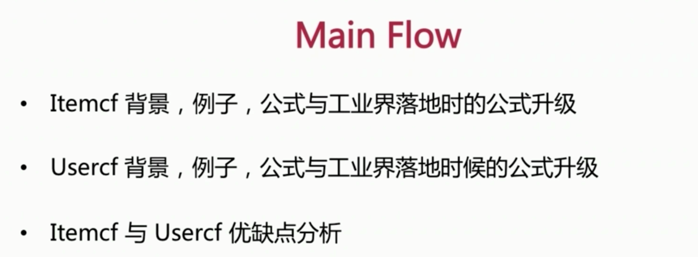
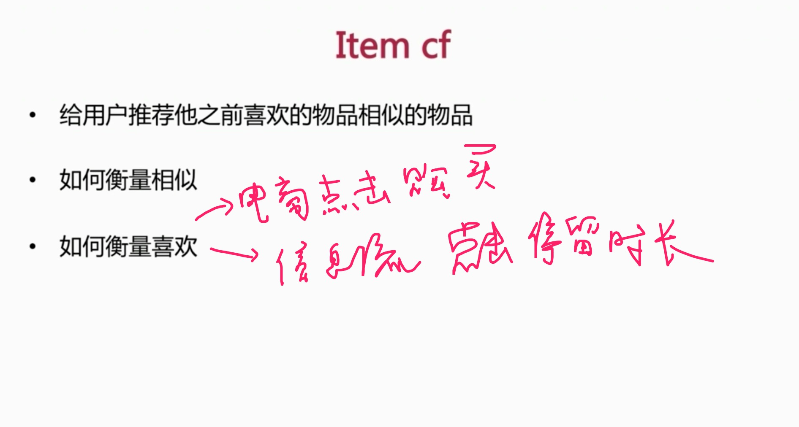
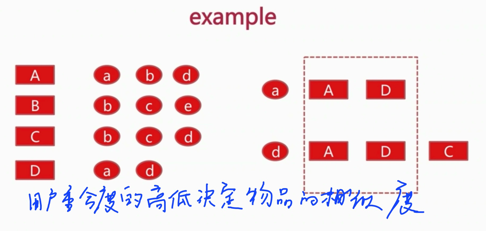
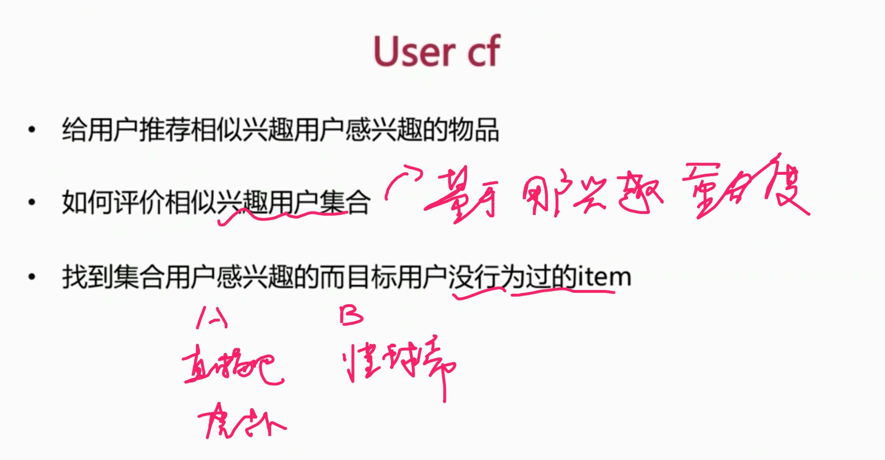
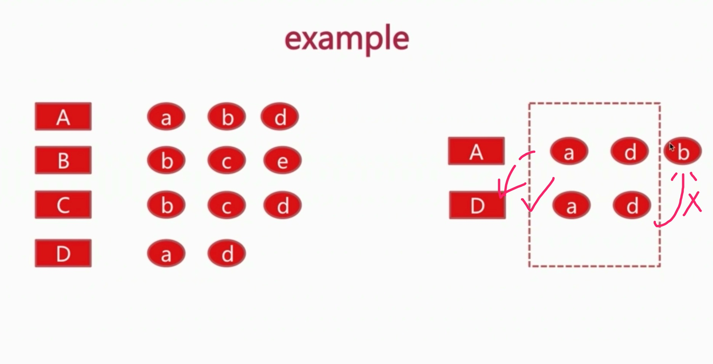
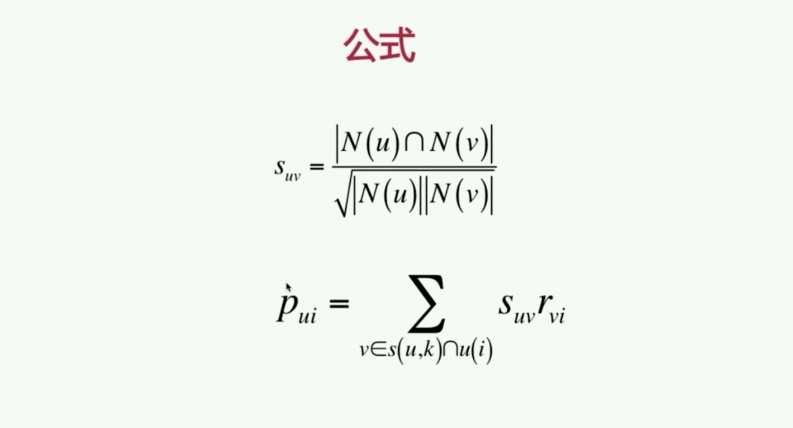
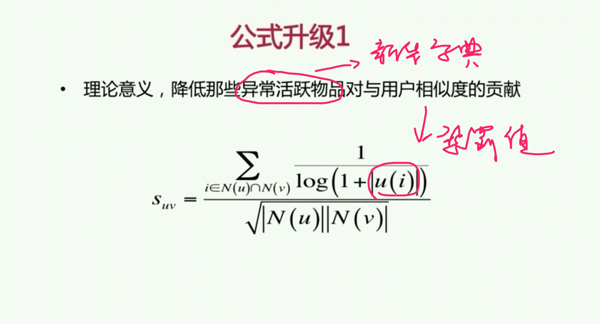
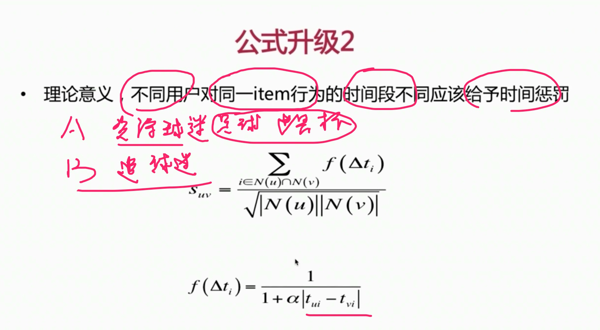
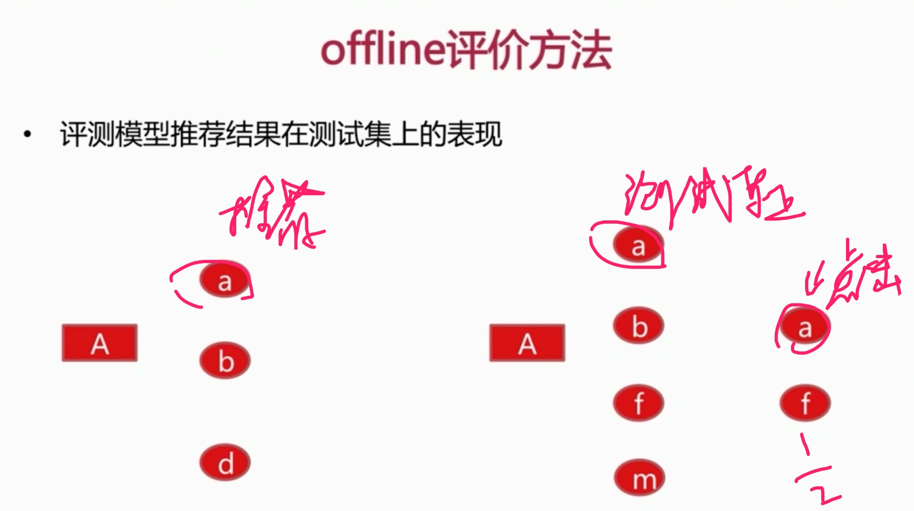

# 1 IterCF

## 1.1 工业界公式升级

# 2 UserCF

## 2.1 工业界公式升级

# 3 ItermCF与UserCF针对不同场景的分析

# 4 个性化推荐召回算法的离线在线评估方法

## 业务指标
* 信息流更关注
  * 点击率：总点击次数/总展现次数
* 平均阅读时长两个小指标
  * 推荐精准度：总阅读时长/click uv
  * 推荐算法对整体趋势的影响：阅读总时长/show uv
* 电商推荐中更关注转化率
  * 转化率：总的成交次数/总的展现次数
  * 总成交额度
## item推荐覆盖率
* 覆盖率：去重后推荐的所有item的id数/库里面所有的itemid数

## offline评价方法
评测模型推荐结果在测试集上的表现

## online评价方法
* 定义指标：点击率、平均阅读时长、覆盖率
* 生产环境中abtest，分离出一部分流量对比
