这部分的所有算法均采用MoviesLens作为数据集，选取的是中等大小数据集，包含6000多用户对4000多部电影的100万条评分。

基于邻域的算法是推荐系统中最基本的算法，该算法不仅在学术界得到了深入研究，而且在 业界得到了广泛应用。基于邻域的算法分为两大类，一类是基于用户的协同过滤算法，另一类是 基于物品的协同过滤算法。
这里要先声明一点，仅仅**基于用户行为数据设计的推荐算法一般称为协同过滤算法CF。**

## 2.1 基于用户的协同过滤算法UserCF（基于邻域）
主要包含两个步骤：
* a. 计算用户之间的相似度：找到和目标用户兴趣相似的用户集合。
* b. 根据用户相似度及用户对物品的评价为物品打分：找到这个集合中的用户喜欢的，且目标用户没有听说过的物品推荐给目标用户。

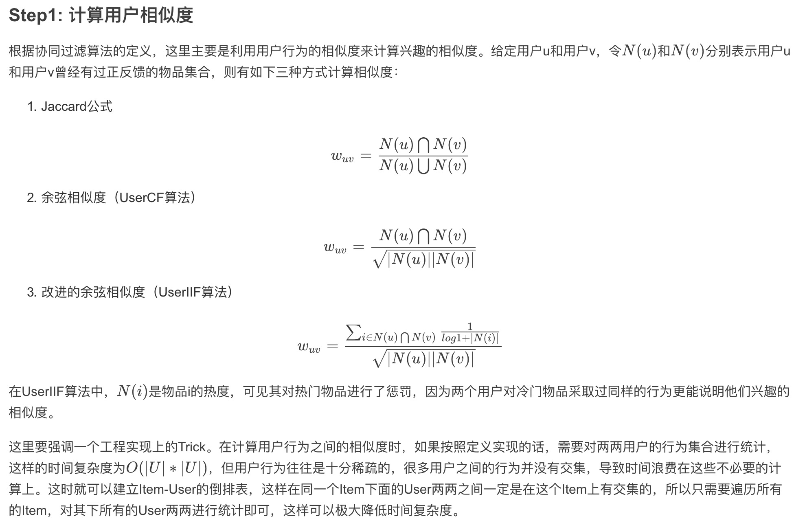
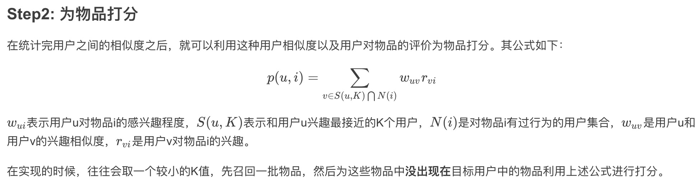

## 2.2 基于物品的协同过滤算法IterCF（基于邻域）
与基于用户的协同过滤算法一样，基于物品的协同过滤算法也是**基于邻域的一种做法**。它也可以分为两步：
* a. 计算物品之间的相似度。
* b. 根据物品的相似度和用户的历史行为为用户生成推荐列表。

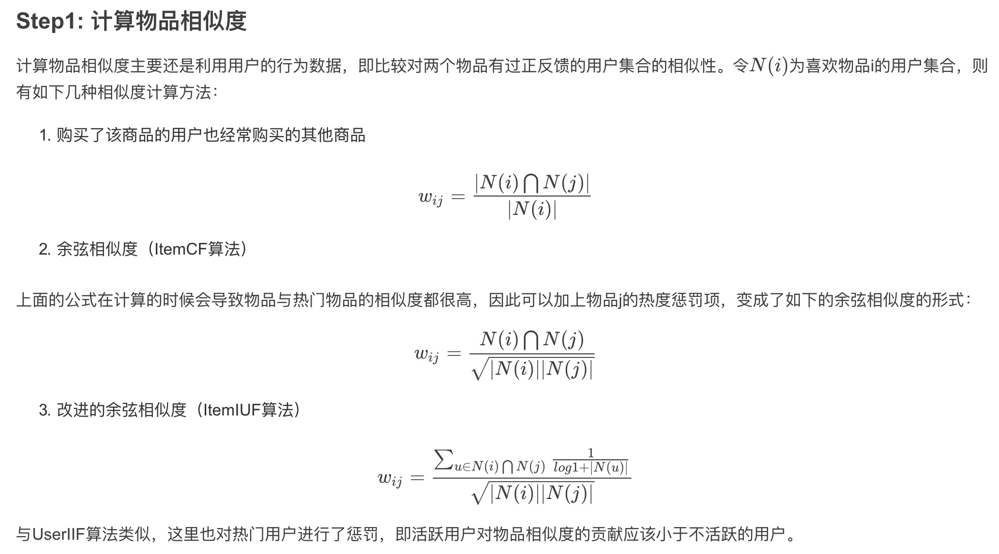
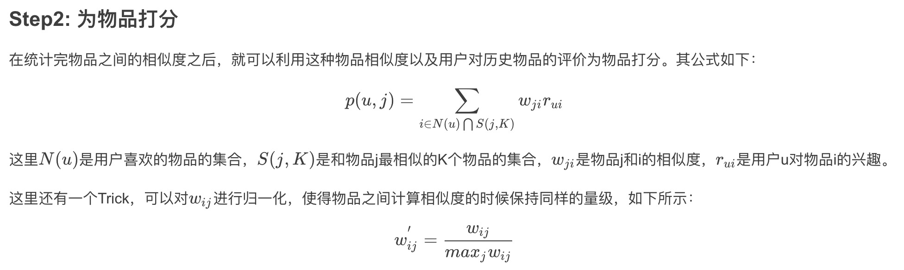

## 2.3 隐语义模型LFM（Latent Factor Model）隐含语义模型

隐类的类别是一个设置的参数。对于基于邻域的机器学习算法来说，如果要给一个用户推荐商品，那么有两种方式。一种是基于物品的，另一种是基于用户的。

* 基于物品的是，从该用户之前的购买商品中，推荐给他相似的商品。
* 基于用户的是，找出于该用户相似的用户，然后推荐给他相似用户购买的商品。

但是，推荐系统除了这两种之外，还有其他的方式。例如如果知道该用户的兴趣分类，可以给他推荐该类别的商品。
为了实现这一功能，我们需要根据用户的行为数据得到用户对于不同分类的兴趣，以及不同商品的**类别归属**。

**类别归属**：根据用户行为来划分每件商品的归属类别，一个商品可以分别属于不同类别，只是在各个类别中的权重不一样。
**用户对于各个类别的喜爱程度**：用户对于不同的类别的喜好程度也不同，该算法可以根据用户的行为数据推测出用户对不同的类别的喜好。
**数据的处理，由于使用的是隐性数据集，只有正样本(用户点击了某件商品)，没有负样本。数据处理主要是选出数据集的负样本。**

**负样本的选取策略**主要有以下要点：
* （1）正负样本要均衡，基本保证**正负样本的比例1:1**
* （2）负样本需要**选择用户没有行为的热门商品**。
选取完成之后，**计算用户对于某件商品的喜爱程度，例如喜欢是1，不喜欢是0**

根据user对item点击与否，获得user与item关系，item与item之间的关系。
LFM输入是user对item的原矩阵，输入参数每一个user的向量表示，每一个item的向量表示，两个相乘获得矩阵，矩阵分解。
模型迭代后，被向量化user1,user2,...。item1,item2,...。
对于维度是事先设定（哪些特征可能会影响user对item的喜好程度，例如：item-title、item-pic）。
假设有7个特征，模型设置的时候可以表示为7，得到7维度user/item向量，相乘得到user1*item1的转置相乘就是一个常数。且常数与原矩阵相似即可。

### 应用场景

* 完成user的item推荐列表(计算用户Toplike)

* 完成item的相似度列表(计算item的topsim)

* 完成item之间隐含topic挖掘(计算item的topic)

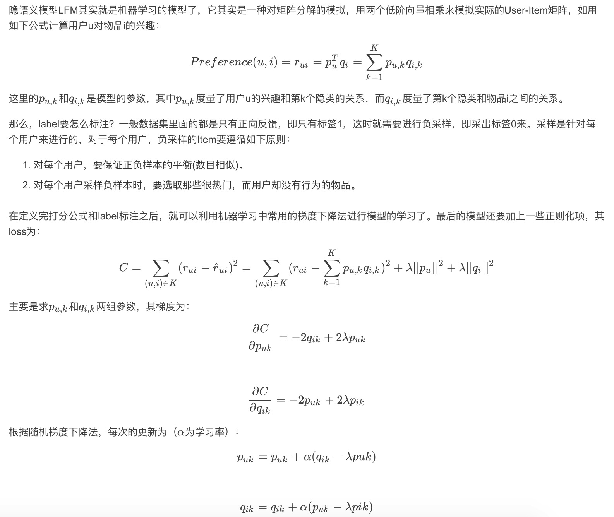

该模型的参数有：
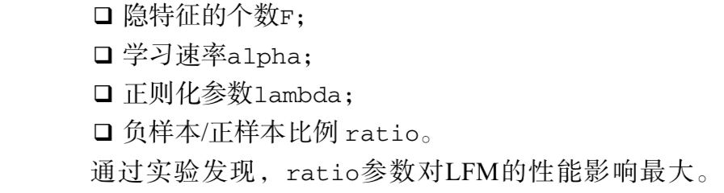

## 2.4 基于图的模型
用户的行为（User, Item）是可以表示为二分图的，比如下图：
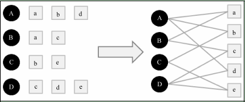
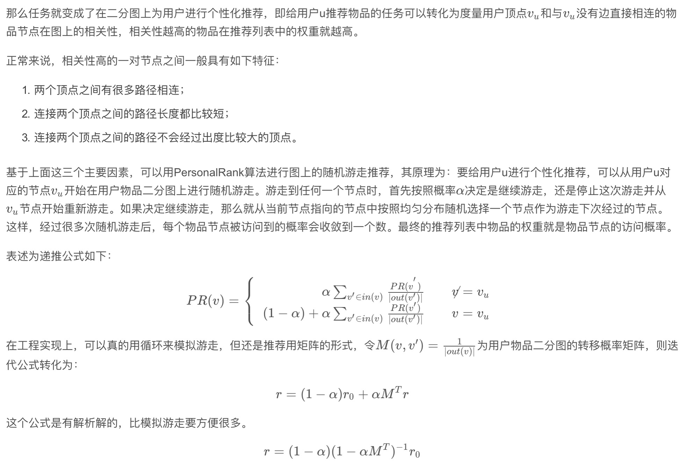

## 2.5 各算法比较

### 2.5.1 UserCF和ItemCF的综合比较

UserCF比较古老，而ItemCF则相对较新
* UserCF给用户推荐那些和他有共同兴趣爱好的用户喜欢的物品，而ItemCF给用户推荐那些和他之前喜欢的物品类似的物品。从这个算法的原理可以看到，UserCF的推荐结果着重于反映和用户兴趣相似的小群体的热点，而ItemCF的推荐结果着重于维系用户的历史兴趣。换句话说，UserCF的推荐更社会化，反映了用户所在的小型兴趣群体中物品的热门程度，而ItemCF的推荐更加个性化，反映了用户自己的兴趣传承。
* UserCF比较适合用于新闻推荐等热门程度和实时性较强的场景。比如一个人看新闻不可能每天只看和之前看的相关的那些，更多的是看今天有哪些新的热门的。从原理上讲，UserCF可以给用户推荐和他有相似爱好的一群其他用户今天都在看的新闻，这样在抓住热点和时效性的同时，保证了一定程度的个性化。从技术角度讲，UserCF主要是维护用户相似度表，在这种场景下，物品的更新速度远超用户，所以维护物品相似度表难度和成本都较高。
* ItemCF则适用于图书、电商、电影等场景。首先这些场景中用户的兴趣是比较固定和长久的，而且一般物品更新的速度不会特别快。

总结如下：
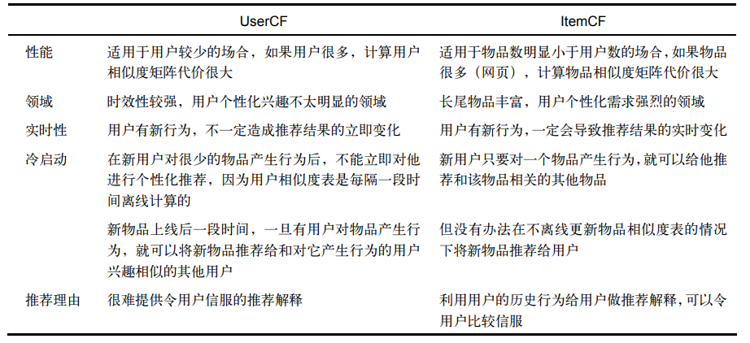

### 2.5.2 LFM与基于邻域CF的方法的比较
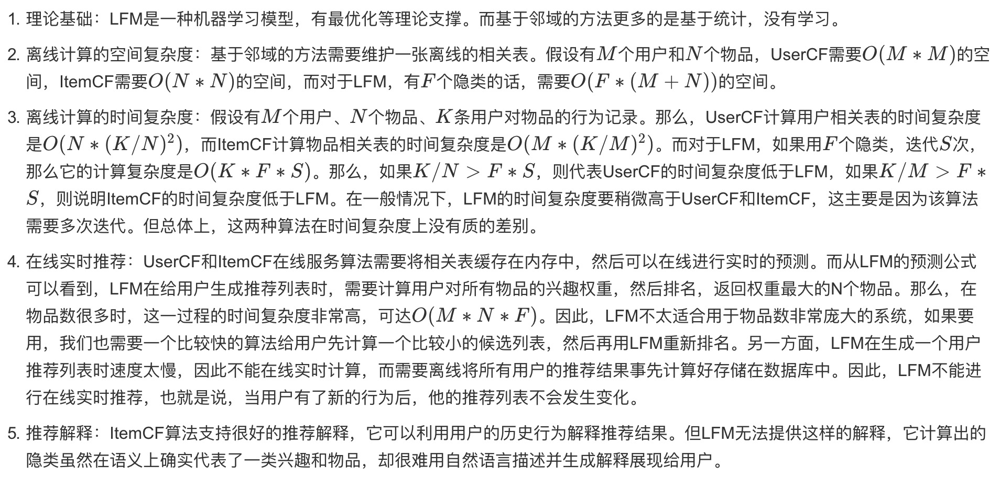

## 2.6 ALS算法

ALS中文名作交替最小二乘法，在机器学习中，ALS特指使用最小二乘法求解的一个协同过滤算法，是协同过滤中的一种。

ALS算法是2008年以来，用的比较多的协同过滤算法。它已经集成到Spark的Mllib库中，使用起来比较方便。

从协同过滤的分类来说，ALS算法属于User-Item CF，也叫做混合CF，因为它**同时考虑了User和Item两个方面**，**既可基于用户进行推荐又可基于物品进行推荐**。

一般而言用户只会购买物品集中的极少数部分产品，并对其进行打分。
考虑下面这样一个包含用户的打分矩阵（列为用户u1-u6，行为物品I1-I8），我们可以看到这个用户的评分矩阵是十分稀疏的，
有很多用户的购买的记录是空的，而且在现实业务中，用户的评分矩阵会更加的稀疏。
如何通过这样一个稀疏矩阵，对用户进行协同推荐用户可能很喜欢的物品对于推荐系统而言是一种很大的考验。

用户评分矩阵：
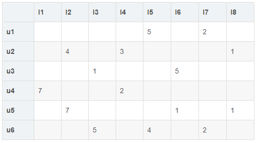

在spark MLlib 机器学习库中目前推荐模型只包含基于矩阵分解(matrix factorization)的实现。
具体的分解思路，**找出两个低维的矩阵，使得它们的乘积是原始矩阵**。因此这也是一种降维技术。
假设我们的用户和物品分别是U和I，那对应的“用户-物品”矩阵的维度为U×I，类似图一所示：
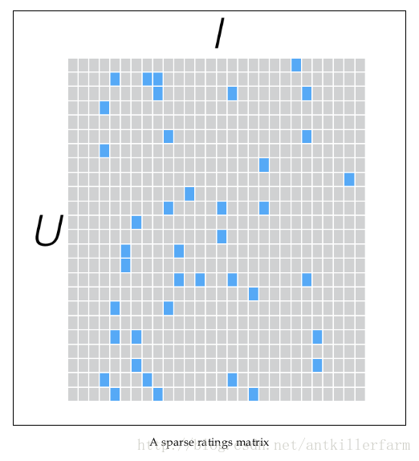

“用户-物品“矩阵近似的k维（低阶）矩阵，最终还是要求出如下两个矩阵：一个用于表示用户U×k维矩阵，以及一个表征物品的I×k维矩阵。
这两个矩阵也称为因子矩阵，他们的矩阵乘积便是原始评级数据的一个近似值。
值得注意的是，原始评级矩阵通常很稀疏，但因子矩阵却是稠密的，如图二所示：
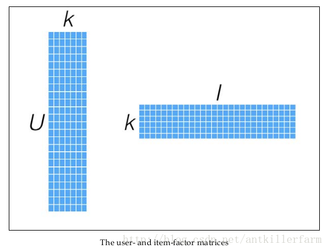

ALS是求解矩阵分解问题的一种最优化方法，它功能强大，效果理想而且被证明相对容易实现。这使得它很适合如Spark这样的平台。
ALS的实现原理是迭代式求解一系列最小二乘回归问题。在每次迭代时，固定用户因子矩阵或者是物品因子矩阵中的一个，然后用固定的这个矩阵以及评级数据来更新另一个矩阵。
之后，被更新的矩阵被固定住，再更新另外一个矩阵。如此迭代，直到模型收敛（或者是迭代了预设好的次数）。
