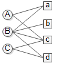
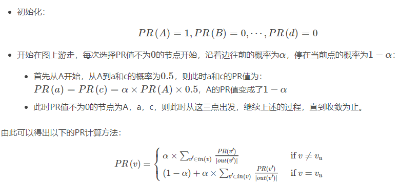

在推荐系统中，通常是要向用户推荐商品，如在购物网站中，需要根据用户的历史购买行为，向用户推荐一些实际的商品；如在视频网站中，推荐的则是不同的视频；如在社交网站中，推荐的可能是用户等等，无论是真实的商品，还是视频，再或者是用户，都可以假设成一种物品，如下图所示：

在上图中，左侧的A，B，C表示的是三个用户，右侧的a，b，c，d表示的是四个商品，中间的连线表示用户与商品之间有过行为，或者是购买或者是打分，推荐的目的是**从商品列表中向指定的用户推荐用户未行为过的商品**。

推荐的算法有很多，包括协同过滤(基于用户的协同过滤和基于物品的协同过滤)以及其他的一些基于模型的推荐算法。

# 基于图的推荐算法PersonalRank算法

在协同过滤中，主要是将上述的用户和商品之间的关系表示成一个二维的矩阵(用户商品矩阵)。

而在基于图的推荐算法中，将上述的关系表示成二部图的形式，为用户A推荐商品，实际上就是计算用户A对所有商品的感兴趣程度。

PersonalRank算法对通过连接的边为每个节点打分，具体来讲，在PersonalRank算法中，不区分用户和商品，因此上述的计算用户A对所有的商品的感兴趣的程度就变成了对用户A计算各个节点B，C，a，b，c，d的重要程度。

PersonalRank算法的具体过程如下(对用户A来说)：

