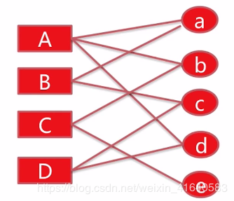
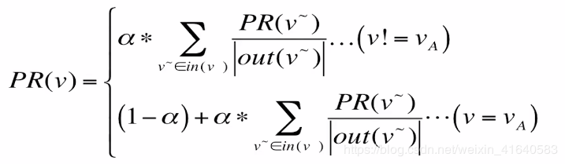
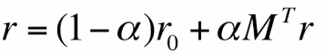
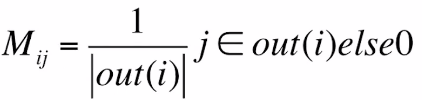
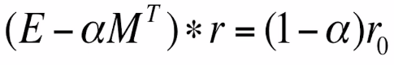
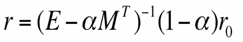
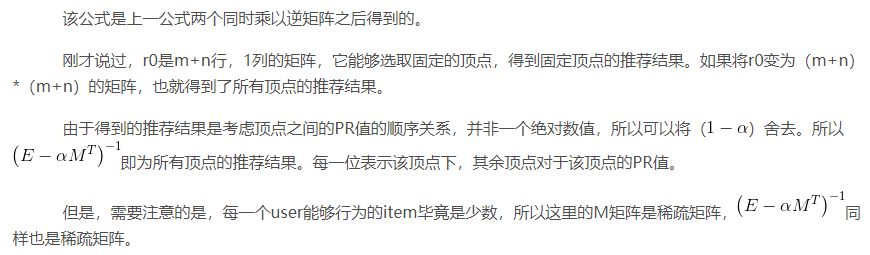

personal rank是可以通过用户行为划分二分图为固定user得到item重要程度排序的一种算法。

# 1.算法的文字阐述

对用户A进行个性化推荐，从用户A节点开始在用户-物品二分图random walk，以alpha的概率从A的出边中等概率选择一条游走过去，到达该顶点后（举例顶点a），有alpha的概率继续从顶点a的出边中等概率选择一条继续游走到下一个节点，或者（1-alpha）的概率回到顶点A，多次迭代。直到各顶点对于用户A的重要度收敛。

# 2.算法的数学公式

把不同item对user的重要程度描述为PR值。

为了便于理解，同样适用A作为固定起点。user A的PR值初始化为1，其余节点的PR值初始化为0。

这里使用 a 节点和 A 节点阐述公式：

从user A出发有3条边，等概率，即1/3的概率到节点a；user B以1/2的概率选择了a。

结合阐述看一下公式的上半部分：**对于不是A节点的PR值，也就是 a 的PR值，那么首先要找到连接该顶点节点，同时分别计算他们PR值得几分之几贡献到要求节点的PR值。那么A将自己PR值得1/3贡献给了 a ，B将自己PR值得1/2贡献给了 a，分别求和，乘alpha，得到 a 的PR值。**

接下来看下半部分：如果要求A节点本身的PR值，首先知道任意节点都会以（1-alpha）的概率回到本身，那么对于一些本来就与A节点相连的节点，比如这里的 a 节点或者 b 节点，它们除了以（1-alpha）的概率直接回到A以外；还可以以alpha的概率从自己的出边中等概率的选择与A相邻的这条边，比如这里的 a 节点，可以以1/2的概率选择回到A节点，所以就构成了下半部分的前后两个部分。

经过分析可以发现，**personal rank算法求item对固定user的PR值，需要每次迭代在全图范围内迭代，时间复杂度在工业界实际算法落地的时候是不能接受的**，所以**要让尽可能多的user并行迭代。结合之前许多其他算法训练的工业界实现，很容易想到矩阵化实现，下面看personal rank算法的矩阵化实现**。

# 3.算法抽象--矩阵式

假设这里共有m个user，n个item。

R矩阵是m+n行，1列，表示其余顶点对该固定顶点的PR值。当然得到了这个，就得到了固定顶点下，其余所有顶点的重要程度排序，这里只需要排出m个user节点。

r0 是m+n行，1列的矩阵，负责选取某一节点是固定节点，它的数值只有1行唯一，其余行全为0。唯一的行，即为选取了该行对应的顶点为固定顶点。那么得到的就是该固定顶点下，其余节点对该固定节点的重要程度的排序。

M 是 m+n行 * m+n列的矩阵，也就是行包含了所有的节点，列也包含了所有的节点。 它是转移矩阵，数值定义如下：1.第一行第二列的数值距离，如果第一行对应的数值顶点由出边连接到了第二列的顶点，那么该值就为第一行顶点的出度的倒数；如果没有连接边，那么就是0。

我们很容易联想到，第一个式子包含了刚才所说的非矩阵化的personal rank的公式的上下两部分。

上述公式是本部分中第一个公式，移项、合并同类项之后得到的。

------------------------------------------------------------------------------------------------------
------------------------------------------------------------------------------------------------------
------------------------------------------------------------------------------------------------------
在推荐系统中，通常是要向用户推荐商品，如在购物网站中，需要根据用户的历史购买行为，向用户推荐一些实际的商品；如在视频网站中，推荐的则是不同的视频；如在社交网站中，推荐的可能是用户等等，无论是真实的商品，还是视频，再或者是用户，都可以假设成一种物品，如下图所示：

在上图中，左侧的A，B，C表示的是三个用户，右侧的a，b，c，d表示的是四个商品，中间的连线表示用户与商品之间有过行为，或者是购买或者是打分，推荐的目的是**从商品列表中向指定的用户推荐用户未行为过的商品**。

推荐的算法有很多，包括协同过滤(基于用户的协同过滤和基于物品的协同过滤)以及其他的一些基于模型的推荐算法。

# 基于图的推荐算法PersonalRank算法

在协同过滤中，主要是将上述的用户和商品之间的关系表示成一个二维的矩阵(用户商品矩阵)。

而在基于图的推荐算法中，将上述的关系表示成二部图的形式，为用户A推荐商品，实际上就是计算用户A对所有商品的感兴趣程度。

PersonalRank算法对通过连接的边为每个节点打分，具体来讲，在PersonalRank算法中，不区分用户和商品，因此上述的计算用户A对所有的商品的感兴趣的程度就变成了对用户A计算各个节点B，C，a，b，c，d的重要程度。

PersonalRank算法的具体过程如下(对用户A来说)：

