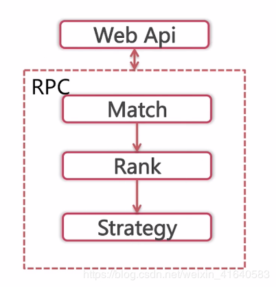
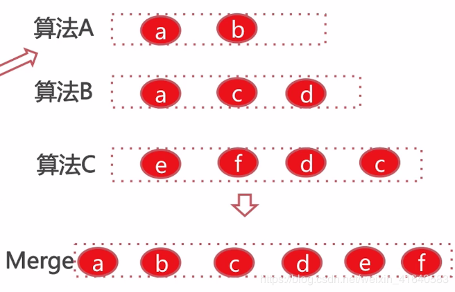
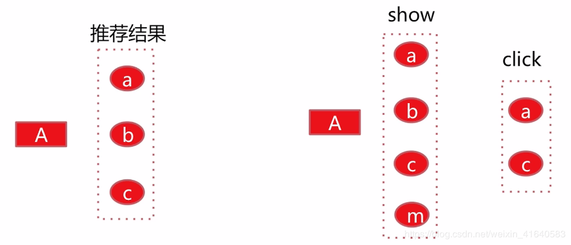

个性化召回算法总结与评估方法

# 一、个性化召回算法的总结
这里会将之前介绍过的几种算法进行归类，并简短介绍每一种个性化召回算法的核心原理；同时演示工业界中多种召回算法共存的架构。

下面看一下之前讲过的个性化召回算法的分类：

## 1. 基于邻域的：CF、LFM、基于图的推荐personal rank

item-CF是item根据user的贡献，得到item的相似度矩阵，用户根据点击过的item的相似item来完成推荐。

user-CF是user根据item的贡献，得到user的相似度矩阵，用户将根据相似用户点击过的物品完成自己的推荐。

LFM是根据user-item矩阵，将矩阵分解，从而得到user与item的向量，将两个向量点乘得到的数值取top k 便完成了推荐。

psersonal rank是根据user与item的二分图，在这个二分图之间随机游走，便得到物品对固定用户的倾向度，把这个倾向度得分叫做PR值。那么取PR值得top k也就完成了用户的推荐。

## 2. 基于内容的：content-base算法

content-base算法的主要流程是：

首先将item进行刻画，然后将user进行刻画，然后将user的刻画与item的刻画在线上推荐的时候串联起来。

## 3. 基于神经网络的：item2vec

item2vec首先根据用户的行为得到由item得到的句柄，根据训练语料得到item embedding的向量，得到这个向量之后就能得到item的相似度矩阵。从而根据用户的历史点击推荐相似的item给用户，也就完成了推荐。

下面看一下工业界中多种召回并存的架构：

后端算法的核心逻辑：

首先是召回，召回之后是排序，排序之后是策略调整，然后就将结果返回给web层。

接下来看一下，具体在召回阶段是如何多种算法并存的。

比如这里的算法A，召回了两个item，分别是a、b；算法B召回了3个item，分别是a、c、d；同理算法C召回了4个item，分别是e、f、d、c。

那么**每一种算法召回的数目是如何确定的呢？**

这里有两种形式：

* 形式一：为了满足rank阶段的性能要求，这里指定召回阶段召回的数目，比如说50个，那么各种算法根据以往的表现来平分这50个，每一个算法有一个比例，比如说算法A是0.2，算法B是0.3，算法C是0.5。这样每一个算法也就有了自己召回的上限。

* 形式二：rank阶段毫无性能压力，我们给算法A写了多少个推荐都能全部召回，其余算法也是相同的处理。

在召回完成之后，我们需要进行一个合并。合并完成之后，我们得到item a~f，将重复召回的进行去重，但是也会给item a标记上它同时是属于算法A和算法B召回的。召回完成之后，这些item进入排序阶段。

# 二、个性化召回算法的评价
在现有的个性化召回体系下，如果要新增一种个性化召回算法，需要知道这种个性化召回算法会对系统造成怎样的影响，是正向收益还是负向收益。所以需要从离线和在线两个方面对个性化召回算法进行评价。

## 离线评价准入

也就是说，在我们新增一种个性化召回算法的时候，我们离线选取了一部分训练文件来训练个性化召回算法的模型。我们根据这个模型得到了一些推荐结果，同时有必要保留一些测试集。在测试集上评价推荐结果的可靠程度。这个可靠程度首先是要有一个预期，这个算法会给线上带来正向还是负向的收益。

当然，最终的结果仍然需要在真实的环境中测试。

**评价方法：评测新增算法推荐结果在测试集上的表现。**

这里用一个例子来具体说明：

如果新增了某种个性化召回算法，对于user A我们给出了推荐结果a、b、c。恰巧这里我们获得了user A在测试集上的展现数据，就是a、b、c、m，那么在这里我们发现有3个是重合的，也就是a、b、c，那么这3个就是分母，如果我们在得到了用户A在测试集上的点击数据，这个点击数据恰好是a、c。我们发现这里的推荐结果是a、b、c是分母，然后有两个被点击了，那么a、c就是分子，最后的点击率就是 2/3。

**如果这个数据是高于基线的点击率的话，那么就可以将这种推荐算法放到线上做ABtest。**

当然了，我们知道线下的评价结果与线上真实环境中的结果是有差异的，但是这种方式是能够给我们一个最基础的、直观的评判，是否可以准入到线上。

这里简单解释一下什么是**测试集**？

举例：**如果我们要使用itemCF这种个性化召回算法，那么我们首先需要计算item的相似度矩阵，我们这里以过去一周的用户的真实的展现与点击数据为依据来训练这个相似度矩阵。我们只使用周一到周五的数据来训练，周六、周日的数据便是这里的测试集。**

## 在线评价收益：ABtest

线上的评价分为两步：

###（1）定义指标

这里需要根据不同的情况，比如说在信息流场景下，我们最关心的就是点击率，平均阅读时长等等指标；但是在电商系统中，我们可能更加关注的是转化率及总的交易额度。

总之要根据自己的产品，来找到最能够评价产品的核心指标。

###（2）生产环境abtest

往往采用以划分id尾号的形式，比如说分出1%的流量在原来的个性化召回体系框架上增加要实验的个性化召回算法。实验几天之后，与基线去比较核心指标的优劣。如果收益是正向的，我们就保留。
