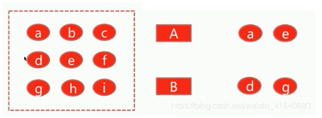
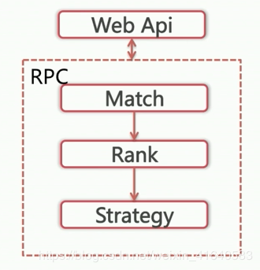
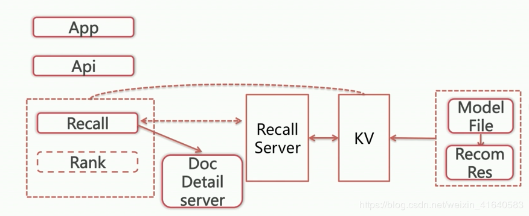

# 1.什么是个性化召回？
召回是从item中选取一部分作为候选集。 

这里就存在一个问题，就是说为什么要选取一部分作为作为候选集，而不是全部？其原因在于：
* 1.不同的用户不会喜欢所有类型的item；
* 2.基于服务性能的考虑，如果选择了全部的item作为候选集，对于后续的排序就将耗费大量的时间，对于整体推荐的后端，服务响应时间将会是灾难性的。

那么个性化召回就顾名思义，就是根据用户的属性行为上下文等信息从物品全集中选取其感兴趣的物品作为候选集，也就是每个人的候选集都不同，那么如何得到候选集呢？

下面举例说明：

如果某个推荐系统中，物品全集是如下左图中9个item，这里有两个用户A和B，他们分别对不同的item感兴趣。这里拿信息流产品举例，如果user A对体育类新闻感兴趣，user B对娱乐类新闻感兴趣，那就按照简单的类别召回，得到结果如下右图所示。

# 2.召回的重要作用？

## 1. 召回决定了最终推荐结果的天花板。

为什么这么说呢？这里先看一下推荐系统的整体架构，工业中的个性化推荐系统中的策略部分的架构主要由一下三部分构成：召回、排序、以及最后的策略调整部分，其中召回部分包括各路个性化召回之后将所有的item merge进入rank部分，rank只是调整召回完item的展现顺序，rank完之后还有一些策略的调整，比如信息流场景中的控制相同作者的数目等等，所以可以看到个性化召回的候选集是多么的重要，因为最终展现给用户的就是从这个候选集中选出来的。那么就可能会有疑问，为什么不能将所有的item进行排序？这是为了保证后端响应时间。

推荐系统整体架构

## 2.个性化召回解析

个性化召回算法分为哪几大类？

（1）基于用户行为的：也就是用户基于推荐系统推荐给他的item点击或者没点。这一类的算法主要有CF以及矩阵分解，还有就是基于图的推荐，这一类的个性化召回算法总体来说就是推荐结果的可解释性较强，比较通俗易懂，但是缺少一些新颖性。

（2）基于user profile的：经过用户的自然属性，也就是说经过用户的偏好统计，那么基于这个统计的类别去召回。推荐效果不错，但是可扩展性较差。也就是说一旦用户被标上了某一个类别或者某几个类别的标签之后，很难迁移到其余的一些标签。

（3）基于隐语义的：新颖性、创新性十足，但是可解释性不是那么强。

# 3.工业界个性化召回架构

标题工业界个性化召回架构
整体的召回架构可以分为两大类：
* 第一大类是基于离线的model file算出推荐结果，这些推荐结果可以是用户喜欢哪些item，也可以是item之间的相似度文件，然后写入KV存储，在线的server recall部分直接调用这个结果，拿到ID之后访问detail server得到详情，再往rank部分传递；
* 另一种，如果采用深度学习的一些model，这是需要将model file算出来的item embedding也存入KV，但是在线的时候需要访问recall server去将user embedding成user向量，同时user向量与embedding向量做最近临召回。
