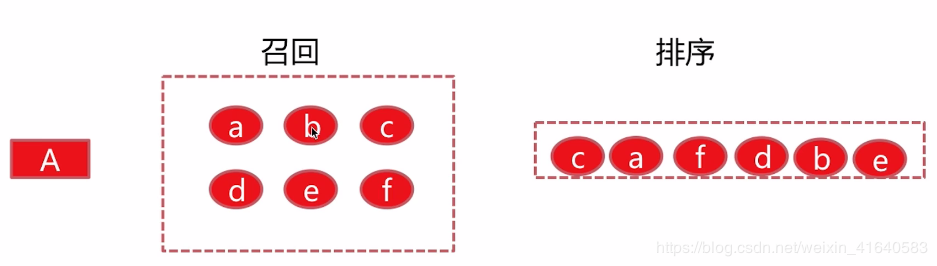
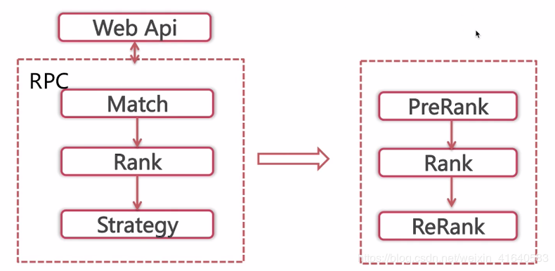

# 一、什么是学习排序？

说起学习排序，首先介绍一下排序，排序是在搜索场景以及推荐场景中应用的最为广泛的。

传统的排序方法是基于构造相关度函数，使相关度函数对于每一个文档进行打分，得分较高的文档，排的位置就靠前。
但是，随着相关度函数中特征的增多，使调参变得极其的困难。所以后来便将排序这一过程引入机器学习的概念，也就变成这里介绍的学习排序。

**那么这里介绍的排序都是指对于单独的文档进行预估点击率，将预估点击率最大的文档排到前面。**

**所以特征的选择与模型的训练是至关重要的。**

# 那么为什么在召回后要学习排序呢？

学习排序：将个性化召回的物品候选集根据**物品本身的属性** + **用户的属性** + **上下文等信息**给出展现优先级的过程。

在推荐系统中，**召回的得分，大部分都不是用用户维度的数据**，都是**各种方式用物品之间的关系数据去获取的**。所以你可以理解成，**协同过滤等方法得的分，是物品的关联程度分**。只靠这个分推也可以，但他不是真正意义上的个性化推荐。召回完成之后，要做排序，而是是个性化排序，才产生真正的个性化推荐，用LR模型即可如此！

对于有一定规模的推荐系统，基本都是分召回和排序两层的。为了追求更好的推荐效果，模型的算力需求通常是比较大的，基本无法应付单个用户到百万千万内容的匹配和排序。目前主流的排序模型，在一定qps和算力支持的基础上，通常能完成单个请求几百到几千的排序任务。

所以，推荐系统常见的做法，是先通过多种低算力的方法簇进行召回，实现初步筛选，然后用排序模型在候选集合上完成打分排序。在较大型的推荐系统中，中间可能会再加一层粗排，变成召回，粗排，精排的内容匹配筛选流。

* 召回使用多种方法簇为排序提供候选集，需要尽量保证后续集和用户的匹配程度，内容的优质程度，内容的丰富程度。
* 粗排进行二次筛选，用相对较小的算力，过滤掉低质低匹配内容，并且要保证多样性和候选集合有一定的探索能力。
* 精排序在最终的集合上进行排序和多目标预估，最后在加入多样性强插等人工干预规则。

个人理解：
* 1. 召回一定是多方法簇混合召回，尽量从不同角度和不同方法筛选候选集。相关性和召回率永远是召回的首要迭代方向，也是最有效的，在相关性和追打效果有一定保证的时候，提升召回的泛化和探索是继续提升推荐效果的一个重要途径。
* 2. 排序需要具备更强的筛选和排序能力，多目标建模结合业务理解的人工规则。用户实时反馈行为的捕捉和利用对排序也是至关重要的，因为模型可以做到比较强的泛化，但是对实时反馈信号的学习和判断总是很难跟上的。

下面用一个例子进行展示：

假设这里有一个用户A，基于他的历史行为给出了召回，可能是很多种召回算法，经过合并之后得到的6个item。

经过排序，最终将这6个item的优先级固定为c、a、f、d、b、e。

得到优先级的过程就是由排序得到的。**分别根据item本身的属性，以及user当前的一些上下文和user固定的一些属性，得到此时最佳的顺序应该是将c给展示，这样以保证最后的点击率最高。**

# 二、排序在个性化推荐系统中的重要作用

之前介绍过，在个性化的算法中后端的主要流程是：**召回-->排序-->策略调整。**

我们说过，召回决定了推荐效果的天花板，那么排序就决定了逼近天花板的程度。

## 1、排序决定了最终的推荐效果

用户看到的顺序基本就是由排序这一步骤所决定的，如果用户在前面的位置就能够看到自己感兴趣的物品，那么用户就会在推荐系统总停留较长的时间；
反之，如果需要用户几次刷新之后，才能得到自己想要的物品，那么用户下一次将不会在信任推荐效果，导致在推荐系统中停留的时间较短。

在工业界中，排序这一部分分为三个步骤：

（1）prerank

也就是排序之前的部分，由于排序的模型由浅层模型切换到深层模型的时候，耗时在不停的增加。
比如之前召回可以允许有5000个物品去做浅层模型，比如说逻辑回归，就是训练出一组参数，那么整体的打分过程耗时很短。

但是，如果当排序模型切换到深层模型，比如说DNN，那么整体需要请求一次新的深度学习的服务，那么这5000个item去请求的时间显然是不能承受的。
所以要先有一个粗排。这个粗排会将这5000个召回的物品进行第一次排序，将候选集缩小到一定范围之内。这样使排序模型的总处理时间满足系统的性能要求。

粗排往往以一些简单的规则为主，比如说**使用后验CTR或者说对于新的物品使用预估的CTR**等等。

（2）Rank

主排序部分就是重点部分，现在业界比较流行的还有一次重排。

* a. 单一的浅层模型：**浅层模型是相较于深度模型而言的，浅层模型的代表有LR、FM**。

这一类模型在**学习排序初期**是非常受欢迎的，因为模型线上处理时间较短，所以它支持特征的维度就会非常的高。但是也存在很多问题：比如像LR模型，需要研发者具有很强的样本筛选以及特征处理能力，这个包含像特征的归一化、离散化、特征的组合等等。

所以，后期发展了浅层模型的组合。

* b. 浅层模型的组合

这里比较著名的是LR+GBDT等等。这一类**模型不需要特征的归一化、离散化，能够较强的发现特征之间的规律，所以相较于单一的浅层模型具有一定的优势**。

* c. 深度学习模型

随着深度学习在工业界应用的不断成熟，以及像**tensorflow等深度学习框架的开源，现在工业界大部分的主排序模型都已经切换到了深度学习模型**。

（3）Rerank

这个重排是将**主排序的结果再放入一个类似于强化学习的一个模型里面去进行一个重排序**，这种主要是**突出了用户最近几次行为的特征，将与最近几次用户行为相近的item给优先的展示，以便获取用户行为的连续性**。

**由于单一item在重排模型的耗时要比主模型长很多，所以重排部分只是会影响主排序头部的一些结果，比如说top 50 的结果去进行一个重排**。那么既然是这样的话，可以看到，最能影响结果的还是主排序模型。

# 三、工业界推荐系统中排序架构解析

工业界中排序是如何落地的。

**算法的后端主流程**是：**召回之后排序**。

**召回完item之后，我们将item集合传给排序部分，排序部分会调用打分框架，得到每一个item在当前上下文下，对当前user的一个得分，进而根据得分决定展现顺序。**

下面看一下打分框架内部的构成：

首先会将每一个item以及user去提取特征，注意这里提取的特征要与离线训练模型的特征保持一致。提取完特征之后，我们向排序服务发出请求，排序服务会返回给我们一个得分，推荐引擎会基于此得分完成排序。经过简单的策略调整之后，展现给用户。

这里需要特别注意的是，**排序服务与离线训练好的排序模型之间的通信**。

**如果是单一的浅层模型，像LR，那么可以直接将训练好的模型参数存入内存**。
当排序服务需要对外提供服务的时候，直接加载内存中模型的参数即可。
像FM以及GBDT等等，我们只需要离线训练好模型，将模型实例化到硬盘当中。
在在线服务当中，由于这些模型都有相应的库函数，他们提供了模型的加载以及模型对外预测等一系列接口，所以便可以完成打分。

但是，对于像深度学习的话，我们在训练完成之后，我们**还需要提供一个深度学习的服务供排序服务调用**。
