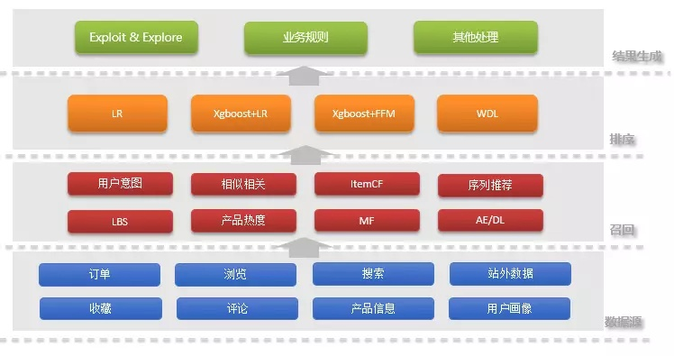
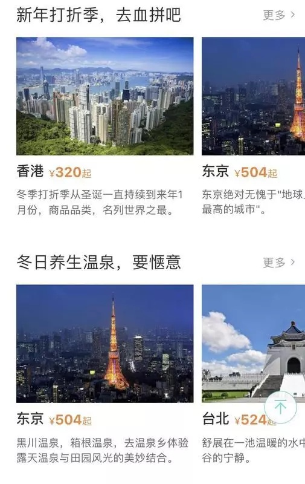
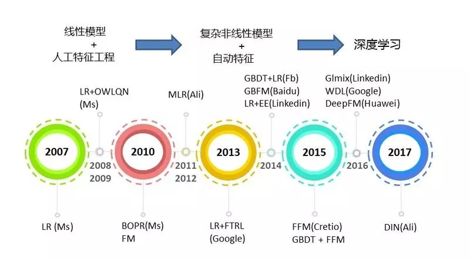

携程作为国内领先的 OTA，每天向上千万用户提供全方位的旅行服务，
如何为如此众多的用户发现适合自己的旅游产品与服务，挖掘潜在的兴趣，缓解信息过载，个性化推荐系统与算法在其中发挥着不可或缺的作用。
而 OTA 的个性化推荐一直也是个难点，没有太多成功经验可以借鉴，本文分享了携程在个性化推荐实践中的一些尝试与摸索。

推荐流程大体上可以分为 3 个部分，召回、排序、推荐结果生成，整体的架构如下图所示。

召回阶段，主要是利用数据工程和算法的方式，从千万级的产品中锁定特定的候选集合，完成对产品的初步筛选，其在一定程度上决定了排序阶段的效率和推荐结果的优劣。
业内比较传统的算法，主要是 CF[1][2]、基于统计的 Contextual 推荐和 LBS，但近期来深度学习被广泛引入，算法性取得较大的提升，
如：2015 年 Netflix 和 Gravity R&D Inc 提出的利用 RNN 的 Session-based 推荐 [5]，
2016 年 Recsys 上提出的结合 CNN 和 PMF 应用于 Context-aware 推荐 [10]，
2016 年 Google 提出的将 DNN 作为 MF 的推广，可以很容易地将任意连续和分类特征添加到模型中 [9]，
2017 年 IJCAI 会议中提出的利用 LSTM 进行序列推荐 [6]。
2017 年携程个性化团队在 AAAI 会议上提出的深度模型 aSDAE，通过将附加的 side information 集成到输入中，可以改善数据稀疏和冷启动问题 [4]。

对于召回阶段得到的候选集，会对其进行更加复杂和精确的打分与重排序，进而得到一个更小的用户可能感兴趣的产品列表。

携程的推荐排序并不单纯追求点击率或者转化率，还需要考虑距离控制，产品质量控制等因素。

相比适用于搜索排序，文本相关性检索等领域的 pairwise 和 listwise 方法，pointwise 方法可以通过叠加其他控制项进行干预，适用于多目标优化问题。

工业界的推荐方法经历从线性模型＋大量人工特征工程 [11] -> 复杂非线性模型 -> 深度学习的发展。

Microsoft 首先于 2007 年提出采用 Logistic Regression 来预估搜索广告的点击率 [12]，并于同年提出 OWLQN 优化算法用于求解带 L1 正则的 LR 问题 [13]，
之后于 2010 年提出基于 L2 正则的在线学习版本 Ad Predictor[14]。

Google 在 2013 年提出基于 L1 正则化的 LR 优化算法 FTRL-Proximal[15]。
2010 年提出的 Factorization Machine 算法 [17] 和进一步 2014 年提出的 Filed-aware Factorization Machine[18] 旨在解决稀疏数据下的特征组合问题，从而避免采用 LR 时需要的大量人工特征组合工作。

阿里于 2011 年提出 Mixture of Logistic Regression 直接在原始空间学习特征之间的非线性关系 [19]。
Facebook 于 2014 年提出采用 GBDT 做自动特征组合，同时融合 Logistic Regression[20]。

近年来，深度学习也被成功应用于推荐排序领域。Google 在 2016 年提出 wide and deep learning 方法 [21]，综合模型的记忆和泛化能力。

进一步华为提出 DeepFM[15] 模型用于替换 wdl 中的人工特征组合部分。

阿里在 2017 年将 attention 机制引入，提出 Deep Interest Network[23]。

携程在实践相应的模型中积累了一定的经验，无论是最常用的逻辑回归模型（Logistic Regression），树模型（GBDT，Random Forest）[16]，因子分解机（Factorization Machine），以及近期提出的 wdl 模型。

同时，我们认为即使在深度学习大行其道的今下，精细化的特征工程仍然是不可或缺的。

基于排序后的列表，在综合考虑多样性、新颖性、Exploit & Explore 等因素后，生成最终的推荐结果。本文之后将着重介绍召回与排序相关的工作与实践。

# 数据 
## 机器学习＝数据＋特征＋模型

在介绍召回和排序之前，先简单的了解一下所用到的数据。

携程作为大型 OTA 企业，每天都有海量用户来访问，积累了大量的产品数据以及用户行为相关的数据。

实际在召回和排序的过程中大致使用到了以下这些数据：
- 产品属性：产品的一些固有属性，如酒店的位置，星级，房型等。
- 产品统计：比如产品一段时间内的订单量，浏览量，搜索量，点击率等。
- 用户画像：用户基础属性，比如年纪，性别，偏好等等。
- 用户行为：用户的评论，评分，浏览，搜索，下单等行为。

值得注意的是，针对统计类信息，可能需要进行一些平滑。例如针对历史 CTR 反馈，利用贝叶斯平滑来预处理。

# 召回

召回阶段是推荐流程基础的一步，从成千上万的 Item 中生成数量有限的候选集，在一定程度上决定了排序阶段的效率和推荐结果的优劣。

而由 OTA 的属性决定，用户的访问行为大多是低频的。这就使得 user-item 的交互数据是极其稀疏的，这对召回提出了很大的挑战。

在业务实践中，我们结合现有的通用推荐方法和业务场景，筛选和摸索出了几种行之有效的方法：

## Real-time Intention

我们的实时意图系统可以根据用户最近浏览下单等行为，基于马尔科夫预测模型推荐或者交叉推荐出的产品。

这些候选产品可以比较精准的反应出用户最近最新的意愿。

## Business Rules

业务规则是认为设定的规则，用来限定推荐的内容范围等。

例如机票推酒店的场景，需要通过业务规则来限定推荐的产品只能是酒店，而不会推荐其他旅游产品。

## Context-Based

基于 Context 的推荐场景和 Context 本身密切相关，例如与季候相关的旅游产品（冬季滑雪、元旦跨年等）。

## LBS

基于用户的当前位置信息，筛选出的周边酒店，景点，美食等等，比较适用于行中场景的推荐。
地理位置距离通过 GeoHash 算法计算，将区域递归划分为规则矩形，并对每个矩形进行编码，筛选 GeoHash 编码相似的 POI，然后进行实际距离计算。

## Collaborative Filtering

协同过滤算法是推荐系统广泛使用的一种解决实际问题的方法。携程个性化团队在深度学习与推荐系统结合的领域进行了相关的研究与应用，通过改进现有的深度模型，提出了一种深度模型 aSDAE。
该混合协同过滤模型是 SDAE 的一种变体，通过将附加的 side information 集成到输入中，可以改善数据稀疏和冷启动问题，详情可以参见文献 [4]。

## Sequential Model

现有的矩阵分解 (Matrix Factorization) 方法基于历史的 user-item 交互学习用户的长期兴趣偏好，Markov chain 通过学习 item 间的 transition graph 对用户的序列行为建模 [3]。
事实上，在旅游场景下，加入用户行为的先后顺序，从而能更好的反映用户的决策过程。我们结合 Matrix Factorization 和 Markov chain 为每个用户构建个性化转移矩阵，从而基于用户的历史行为来预测用户的下一行为。
在旅游场景中，可以用来预测用户下一个目的地或者 POI。除此之外，也可以使用 RNN 来进行序列推荐，比如基于 Session 的推荐 [5]，使用考虑时间间隔信息的 LSTM 来做下一个 item 的推荐等 [6]。

此外，一些常见的深度模型 (DNN, AE, CNN 等)[7][8][9][10] 都可以应用于推荐系统中，但是针对不同领域的推荐，需要更多的高效的模型。
随着深度学习技术的发展，相信深度学习将会成为推荐系统领域中一项非常重要的技术手段。

以上几种类型的召回方法各有优势，在实践中，针对不同场景，结合使用多种方法，提供给用户最佳的推荐，以此提升用户体验，增加用户粘性。

# 排序

以工业界在广告、搜索、推荐等领域的实践经验，在数据给定的条件下，经历了从简单线性模型＋大量人工特征工程到复杂非线性模型＋自动特征学习的演变。

在构建携程个性化推荐系统的实践过程中，对于推荐排序这个特定问题有一些自己的思考和总结，并将从特征和模型这两方面展开。

## Model

个性化排序模型旨在利用每个用户的历史行为数据集建立其各自的排序模型，本质上可以看作多任务学习 (multi-task learning)。
事实上，通过加入 conjunction features，也就是加入 user 和 product 的交叉特征，可以将特定的 multi-task 任务简化为单任务模型。

梳理工业界应用的排序模型，大致经历三个阶段，如下图所示：

本文并不准备详细介绍上图中的算法细节，感兴趣的读者可以查看相关论文，以下几点是我们的一些实践经验和体会。
* 在实践中选用以 LR 为主的模型，通过对数据离散化、分布转换等非线性处理后使用 LR。一般的，采用 L1 正则保证模型权重的稀疏性。在优化算法的选择上，使用 OWL-QN 做 batch learning，FTRL 做 online learning。
* 实践中利用因子分解机（Factorization Machine）得到的特征交叉系数来选择喂入 LR 模型的交叉特征组合，从而避免了繁杂的特征选择工作。一般的受限于模型复杂度只进行二阶展开。对于三阶以上的特征组合可以利用基于 mutual information 等方法处理。已有针对高阶因子分解机（High Order FM）的研究，参见文献 [24]。
* 对于 Wide and Deep Learning，将 wide 部分替换 gbdt 组合特征，在实验中取得了较好的效果，并将在近期上线。后续的工作将针对如何进行 wide 部分和 deep 部分的 alternating training 展开。

## Feature Engineering

事实上，虽然深度学习等方法一定程度上减少了繁杂的特征工程工作，但我们认为精心设计的特征工程仍旧是不可或缺的, 
其中如何进行特征组合是我们在实践中着重考虑的问题。一般的，可以分为显式特征组合和半显式特征组合。

## 显式特征组合
对特征进行离散化后然后进行叉乘，采用笛卡尔积 (cartesian product)、内积 (inner product) 等方式。在构造交叉特征的过程中，需要进行特征离散化；针对不同的特征类型，有不同的处理方式。

### numerical feature
无监督离散化：根据简单统计量进行等频、等宽、分位点等划分区间有监督离散化：1R 方法，Entropy-Based Discretization (e.g. D2，MDLP)ordinal feature（有序特征）编码表示值之间的顺序关系。
比如对于卫生条件这一特征，分别有差，中，好三档，那么可以分别编码为 (1,0,0),(1,1,0),(1,1,1)。

### categorical feature (无序特征)
* 离散化为哑变量，将一维信息嵌入模型的 bias 中，起到简化逻辑回归模型的作用，降低了模型过拟合的风险。
* 离散特征经过 OHE 后，每个分类型变量的各个值在模型中都可以看作独立变量，增强拟合能力。一般的，当模型加正则化的情况下约束模型自由度，我们认为 OHE 更好。
* 利用 feature hash 技术将高维稀疏特征映射到固定维度空间

## 半显式特征组合
区别于显式特征组合具有明确的组合解释信息，半显式特征组合通常的做法是基于树方法形成特征划分并给出相应组合路径。
一般做法是将样本的连续值特征输入 ensemble tree，分别在每颗决策树沿着特定分支路径最终落入某个叶子结点得到其编号，
本质上是这些特征在特定取值区间内的组合。ensemble tree 可以采用 Gbdt 或者 random forest 实现。
每一轮迭代，产生一棵新树，最终通过 one-hot encoding 转化为 binary vector，如下图所示。

以下几点是我们在实践中的一些总结和思考。
* 在实验中发现如果将连续值特征进行离散化后喂入 gbdt，gbdt 的效果不佳，AUC 比较低。这是因为 gbdt 本身能很好的处理非线性特征，使用离散化后的特征反而没什么效果。xgboost 等树模型无法有效处理高维稀疏特征比如 user id 类特征，可以采用的替代方式是: 将这类 id 利用一种方式转换为一个或多个新的连续型特征，然后用于模型训练。
* 需要注意的是当采用叶子结点的 index 作为特征输出需要考虑每棵树的叶子结点并不完全同处于相同深度。
* 实践中采用了 Monte Carlo Search 对 xgboost 的众多参数进行超参数选择。
* 在离线训练阶段采用基于 Spark 集群的 xgboost 分布式训练，而在线预测时则对模型文件直接进行解析，能够满足线上实时响应的需求。此外，在实践发现单纯采用 Xgboost 自动学到的高阶组合特征后续输入 LR 模型并不能完全替代人工特征工程的作用；可以将原始特征以及一些人工组合的高阶交叉特征同 xgboost 学习到的特征组合一起放入后续的模型，获得更好的效果。

# 总结

完整的推荐系统是一个庞大的系统，涉及多个方面，除了召回、排序、列表生产等步骤外，还有数据准备与处理，工程架构与实现，前端展现等等。 
在实际中，通过把这些模块集成在一起，构成了一个集团通用推荐系统，对外提供推服务，应用在 10 多个栏位，60 多个场景，取得了很好的效果。
本文侧重介绍了召回与排序算法相关的目前已有的一些工作与实践，下一步，计划引入更多地深度模型来处理召回与排序问题，并结合在线学习、强化学习、迁移学习等方面的进展，优化推荐的整体质量。

作者简介携程基础业务研发部 - 数据产品和服务组，专注于个性化推荐、自然语言处理、图像识别等人工智能领域的先进技术在旅游行业的应用研究并落地产生价值。目前，团队已经为携程提供了通用化的个性化推荐系统、智能客服系统、AI 平台等一系列成熟的产品与服务。

# 推荐系统还是比较复杂的，包括了数据，架构和算法知识

* 大公司一般会把人才分得很细，包括算法岗，负责推荐算法策略；
* 工程岗，负责推荐系统后台服务的开发迭代；
* 数据岗，各种日志数据的计算处理，如清洗、统计分析等，有时这部分工作也交有算法岗人员完成。

推荐系统可以简单做，也可以深入做。

可以从以下几个方面去判断他是否真的做过推荐系统：

（1）数据。

一是埋点数据，如和设计曝光埋点、点击埋点等，最终的效果评价和模型训练都依赖于埋点。

二是效果数据，推荐系统效果如何评估，有哪些指标，候选人曾设计的推荐系统效果数据如何。

当然了，一个简单的推荐系统可能压根就没有埋点，最终也无法评价推荐系统的效果。

数据是推荐系统之根本，如果不关心数据的人，还是不要了吧。

（2）系统。

简单的推荐系统是离线计算一堆结果，例如由算法人员计算出的协同过滤结果、用户tag、热门数据、关联规则等（这些其实只能算召回），然后导入到kv系统如redis中，线上服务去读取结果数据，最后基于一些规则返回给客户端。
复杂一点的推荐系统包含召回和排序两个阶段，排序指对召回的结果，做机器学习排序，目标是优化最终的转化率。最重要的一点，系统需支持abtest，每次策略的迭代都是拿数据好坏说话。
围绕这些功能模块，如何把系统做得通用，扩展性好，又是一个话题了，这里不做描述。

（3）算法。

推荐围绕召回和排序有很多算法，这块的资料很多。重要是其实践的算法的效果如何，不同场景的差别，候选者需要明了。
总之，推荐系统是一个复杂的工程，围绕这几方面可以做各种细致的考察。
