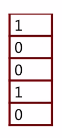
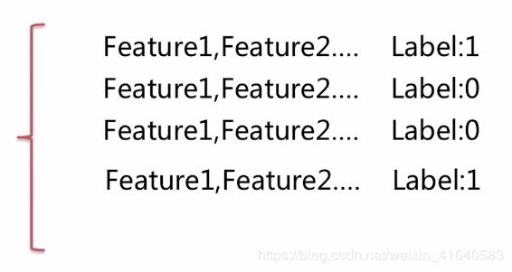

个性化推荐系统样本选择与特征选择相关知识

下面首先看一下样本方面的知识。

在点击率预估过程中，需要的样本是带有label的，也就是点击或者未点击，这是大前提。也就是说，每个用户的每次刷新，我们都能对应上item是否被点击。这么多的样本都是我们训练时候的有效样本么？

当然不是！

下面首先看一下样本的选择规则。

# 一、样本选择规则

这里面主要包含两个因素，1. 采样比例； 2. 采样率。

## 1. 采样比例

**正负样本需要维持一个正常的比例，正常的比例需要符合产品的实际形式。**比如说某个产品，用户三次到来就会产生一次购买，那么我们的正负样本就是1:2的比例。

当然，模型训练还有很多的采样规则，**比如说在某些模型训练的时候，我们需要确保userid的样本达到平均水平，比如说最少要20个**。这个时候，就需要做**样本增强**。对于该userid下的样本，我们需要给他一个特定的权重，来确保它虽然样本少，但是也能达到最低要求。

## 2. 采样率

当模型没有办法用所有的训练数据的时候，必须设定一定的采样率。**常用的随机采样的方法**就是其中的一种。

# 二、样本过滤规则

样本过滤规则有两个大方面：

## 1. 结合业务情况

比如在样本选取时，**需要去除爬虫带来的虚假请求，测试人员构造的测试 id 数据，作弊数据等等**。还需要根据特定场景下模型的目标来保证样本选取的有效性。

下面以具体的实例来说明**如何选取有效的数据来保证模型训练的目标。**

这是某个推荐系统展现给用户的推荐列表，用户依次看到的是itemid1 、itemid2 ....itemid5，同时用户对着5个item分别做了不同的处理，用户点击了itemid1和itemid4，并没有点击itemid2、itemid3、itemid5。这时，我们在构建训练样本的时候，是不是这5个样本都需要呢？

答案是否定的。

这里我们只需要前四个。为什么不要第5个呢？下面解释一下原因呢：

**我们模型的最终学习目的是希望用户能够在最开始的位置发生点击，而不用下拉。**所以，目标是**将最终的推荐列表学习成1,1,0,0,0的形式**。
在这里我们发现，逆序对是0,0,然后1。对于最后的这个0，我们有两方面的原因不选择它作为训练样本，
* 第一方面，我们不能确定用户是否真的看到了这个数据，对于以上的4条，我们可以确定用户真的看到了，因为最后的点击发生在第四条，用户想要点击到第4条，就需要下拉看到第4条数据；
* 第二个原因，是因为这个数据对我们学习的目标是没有帮助的，如果选取还会增加负样本所占的比例。

结合刚才的分析，最终在这一次展现当中，我们得到了4条样本。

他们分别是位于位置1、位置2、位置3、位置4的样本，我们队每一条样本选取了一些特征，打上label。同时并没有选取位置5的数据。

## 2. 异常点的过滤

常用的方法有基于统计的方法。举个例子，比如说:
**某个特征，就以某item被评论的数目这个特征为例，99%的评论数目都均匀的分布在0-5000之间，而top 1% 有几十万、几百万这种数量级的评分。**
**对于这种数据，我们选取一个阈值，大于这个阈值的直接去掉，为什么呢？因为这会给我们在归一化的过程中，造成极大的样本分布不均。**

还有就是**基于距离的方法**。比如说，**某一样本数据与其余样本点的之间的距离，有80%都超过了我们所设定的阈值，这个样本就需要被过滤掉。**

# 三、特征方面

首先对特征进行一个概述，**特征如果按照数值类型可以分为连续值类型和离散值类型**。

举个例子，连续值类型，像item的平均观看时长可能是3.75分钟，4.28分钟等等。所以说，是不可穷举的。

而离散值类型是可以穷举的，比如说某人的学历，就是小学、初中、高中、大学、研究生、博士等。

同样，按照统计的力度同样可以分为低纬度和高纬度，低纬度的特征包含像人的年龄、性别，高纬度的特征像这个人他过去30天喜欢什么样的电影，这个人历史上喜欢什么类型的电影等等。

根据数值变化的幅度，可以将特征分为稳定特征和动态特征，稳定特征就想item的历史点击率，而动态特征就想item的天级别的点击率。

特征的概述就概述到这里。

下面看一下如何做特征选择。

## 1. 特征的统计和分析

**首先需要知道特征的获取难度**，比如说，我们想使用用户的年龄和性别这两个特征，我们发现用户画像中并没有这两个维度。如果需要的话，我们需要根据用户的行为建立一个模型，预估这两个特征。显然成本是较大的，就需要放弃。

**第二个是需要看一下覆盖率，同样是用户的年龄和性别这两个特征进行举例**。如果说发现能够获取到，但是在整体的覆盖率上不足1%，我们也是不能够用的。

**下一个就是特征的准确率*，我们发现视频的平均播放时长都只有几毫秒，显然这是违背常识的，那么这个特征也是不能够使用的。

在我们初步分析了哪些特征可以使用之后，我们到底选取什么样的特征来完成训练呢？

## 2. 特征的选择

主要分为两个大方面：

（1）根据自己的建模常识，也就是说我们想预估一个目标的话，我们知道哪些特征与这个目标是紧密相连的。比如我们想预估这个item的点击率，那么很明显这个item的类别与这个用户喜欢观看的类别是强相关的特征。还有一些强相关的特征，比如这个item的历史点击率，在我们初步根据自己的常识选取了这么多的特征之后，我们训练出了第一版的模型。

（2）那么剩下的特征选择第二步就是基于模型的表现。我们训练完了基线版的模型之后，如果不能够满足我们对于目标的需要的话，我们应该不停的增减特征来发现增减特征对模型指标的影响。如果说减掉某个特征，反而指标变好的话，那么很明显这个特征就不应该是我们需要的。

实际上，在我们选定了特征之后，想要让模型能够识别这些特征，我们需要将特征变成数字。这也就是特征的预处理。

## 3. 特征的预处理

特征的预处理往往包含三大步骤：

（1）缺省值的填充

缺省值是指某些样本里的某些特征是缺失的，我们应该用什么样的规则来填充呢？

业界常用的规则有：使用这个特征的众数，或者是平均数来填充。

（2）归一化

归一化是指将不同维度的数值特征都转化到0,1之间，这样有利于减少由于不同特征绝对数值的影响，对模型权重的影响。举个例子：比如说有一个特征是收入，这个收入可能是几千几万的大数据；还有一个特征是工作的时长，这个工作的时长可能每周都在40-60小时之间，这样可以发现数量值是不一样的。我们需要将他们归一化，这个归一化可以使用排序归一化，以及最大值归一化等等。

排序归一化是指：这一维度的特征按数字进行排序，排序最大的数字将变成1，排序最小的数字变成0。那么举一个例子：如果说一共有10个样本，那么这10个样本之间进行了排序，按照数字的大小，显然最小的对应0.1，第二小的对应0.2，依次类推，最大的变成了1，这样就归一化了0-1之间。如果样本的数目更大，就依此类推。

最大值归一化是指：我们统计出这一维度特征的最大值，然后让所有数字都除以这个最大值，显然这一维度的特征就会被归一化到0-1之间。

（3）离散化

特征的离散化并不是所有模型都需要的，但是LR模型是需要的。

下面以具体的例子讲解什么是离散化：

首先以一个连续值举例，这个值表示人平均每周工作的时长，这个人每周工作23小时，我们怎么离散化呢？

首先需要统计一下，我们样本当中这一维度特征的分布，比如我们想四段离散化，这里我们就需要统计一下四分之一分位点。

这里就是0-18小时是一个区间，18-25小时是一个区间，25-40小时是一个区间，40-无穷大是另一个区间。
那么我们总共有4个区间，这4个区间我们发现23是位于18-25这个区间，那么就离散化成了 [0,1,0,0]。
如果这个值不是23，而是60，显然特征就会被离散化成[0,0,0,1]。

当然，这里也可以不被4段化，而是5段，我们只需要按相应的去统计就可以了。

下面再以一个离散值来举例，如果说一个人的国家是中国，系统中只有三个国家，那中国对应的实例化特征就是[1,0,0]，美国便是[0,1,0]。

